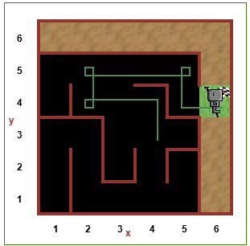

# Day 6 Project: Escaping the Maze
## Topics covered in leason include
- Functions
- Tabs vs Spaces
- While Loops
## Project
The goal for today was to tackle various challenges on the reborg world website. The final challenge was to solve the maze challenge. 

Inside of the escapemaze.py file is the code used on the website to solve the maze challenge. The lesson started out with creating a custom function and using while loops to progress the robot to the finish line. Additionally a while loop was added to catch scenarios where the robot spawns in a location where there is no wall in its proximity.

