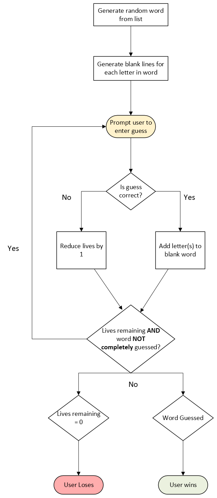

# Day 7 Project: Hangman Game
## Topics covered in leason include
Lesson builds on topics covered in the previous daily lessons.

This includes
- Importing modules
- Loops
- If/Else blocks
- Lists
- etc.
## Project
### Game Logic
The game first starts out by selecting a random word from the wordlist list that is imported from word_list.py Afterwards a placeholder is created with blank slots equal to the amount of characters in the randomly selected word. These underscores are then displayed to the user along with the number of lives that the user has which starts out at six. The number of lives are also used to display the hangman ascii art which is imported from the art.py file. The lives variable matches the index of the stages file to display the ascii art based on the number of lives remaining.

The user is then prompted to guess a letter. If the letter is in the word, then the placeholder is updated to replace the matching underscore with the correct letter and is reflected on the screen. If the letter is incorrect, the user loses a life and the ascii art is updated to reflect the number of lives remaining. Fortunately, if the user tries to guess a letter that has been previously guessed, then the user is informed that the user has already guessed that letter and they are not penalized for guessing an incorrect letter a second time. This process is repeated until the word is completely revieled or the user runs out of lives.

Once the user wins or loses, the user is prompted to see if they would like to play again. If the user types yes then the variables in the game are reset to their starting values and a new random word is selected. If the user selects no (or any word that does not start with y) the game is exited.
### Diagram
