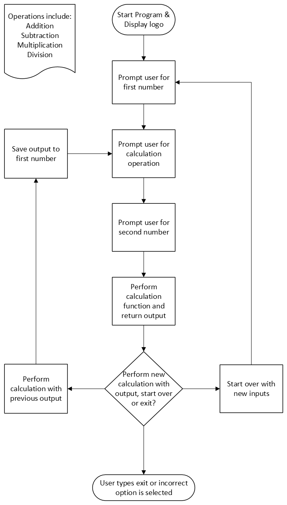

# Day 10 Project: Python Calculator
## Topics covered
The end goal for day 9 of the 100 Days of Code course was to build a calculator program. The day’s lesson covered the following topics:
- Functions that return outputs
- Docstrings
- Assigning a function to a variable
- Recursion
## Project
### Program Walk Through
The calculator program has several components to ensure the desired behavior is performed. To start out, there are four functions – **add**, **subtract**, **multiply** and **divide**. These functions perform the specified mathematical operation and return the numeric output of the operation.

These functions are then passed to a dictionary called **operations**. The dictionary’s entries will later be accessed by the user based on what mathematical operation they select to perform.

Moving on the logic of the program, the program exists within a while loop which continues to operate until the user selects the option to exit the program, or an invalid option is selected.

The user is first asked to enter a number, select an operation and enter a second number. Based on the operation the user selected, the operation is accessed from the operations dictionary and the result of that operation is then displayed to the user. The user is then asked if they would like to continue calculating with the previous output, start over with a clean slate, or exit the program (entering an invalid option also exits the program). 

If the user selects that they would like to continue calculating with the previous output, that output is saved to a variable called **previous_result** and the user is prompted for an operation and second number.

If the user selects to start over with a blank slate, then **previous_result** is left at 0, which triggers the user to be prompted for two numbers and an operation to perform.

This loop is repeated until the user selects to exit the program.

### Diagram
