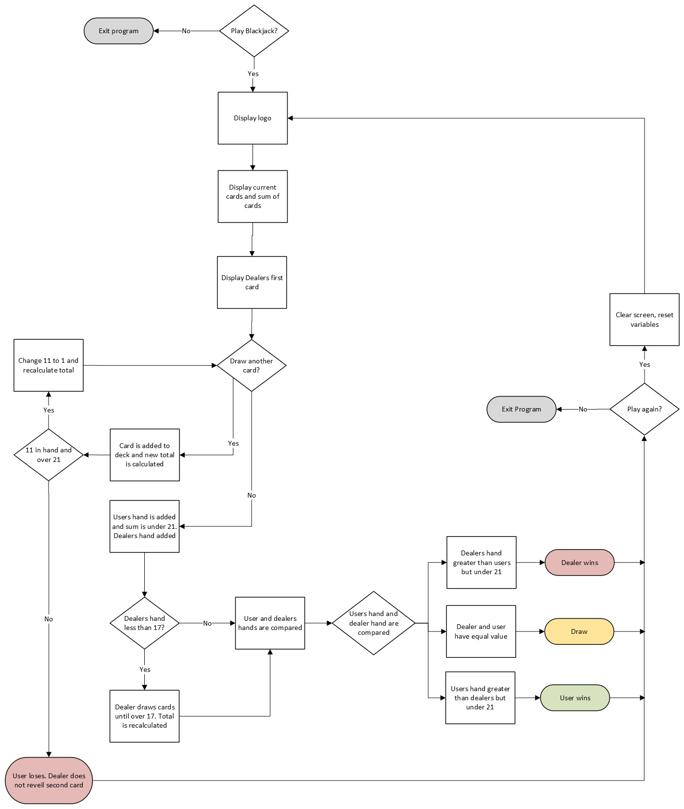

# Day 11 Project: Blackjack Game
## Capstone Overview
This is the first capstone proejct of the 100 Days of Code course. The project itself is to create the game of Blackjack that follows the house rules listed below. This capstone builds on all the previous lessons learned from the first 10 days of the course.
## Project
### House Rules
1. The deck is unlimited in size
2. There are no jokers
3. The Jack/Queen/King all count as 10
4. The Ace can count as 11 or 1
5. Cards in card list have equal probability of being drawn
6. Cards are not removed from the deck
7. The Computer is the dealer
### Modules Used
- Random
- OS

### Possible Outcomes
1. User busts (score over 21, dealer does not reveal second card or draw additional cards) - **Dealer wins**
2. Dealer busts (score over 21) - **User wins**
3. User's hand greater than dealer's hand but not over 21 - **User wins**
4. Dealer's hand greater than user's hand but not over 21 - **Dealer wins**
5. User's score and dealer's score are tied resulting in a **draw**

### Project Walkthrough
The blackjack program first starts out by asking the user if they would like to play a game of Blackjack. Depending on what the user selects here, the program will exit right away or if the user selects **"y"**, then the game will proceed.

After selecting to start the game, the game’s logo is displayed along with the user's current hand, their hands total, and the dealer's first card. Both players hands are populated from the **CARDS** list using random.choice(). The sum of the user and dealer’s hands are then calculated and stored in the variables **user_score** and **dealer_score**. 

The user is then prompted to see if they would like to draw another card.
If the user selects that they would like to draw another card, a card is appended to their hand and their hand’s total is recalculated. If the user has not gone over 21, then the user is prompted again if they would like to draw another card. This repeats until the user says that they would not like to draw another card, or they want to end their turn.

If the user has an Ace (11) in their hand, **AND** their score is over 21, the 11 is swapped out for a 1 and their score is recalculated. The user is then prompted if they would like to draw another card or end their turn. 

If the user has not busted and they ended their turn, it is the dealer’s turn to draw a card. The dealer is set to keep drawing cards until their score is over 17.  As with the user, if there is an Ace in the dealer’s hand then that value is swapped out for a 1 and their score is recalculated. 

Once the dealer has a score that is over 17, then the program proceeds to compare winning scenarios (not counting the user going over 21 which is processed earlier in the program). These scenarios include the user winning, the user losing, or the game ending in a draw. The **Possible Outcomes** section above lists all the possible outcomes for how a game can end.

This brings the current round to an end. The user can play another game or exit out of the program. If the user chooses to play again, all variables are reset to their starting values, and the game’s process is then repeated until the user chooses to exit the program.

### Flow Chart
