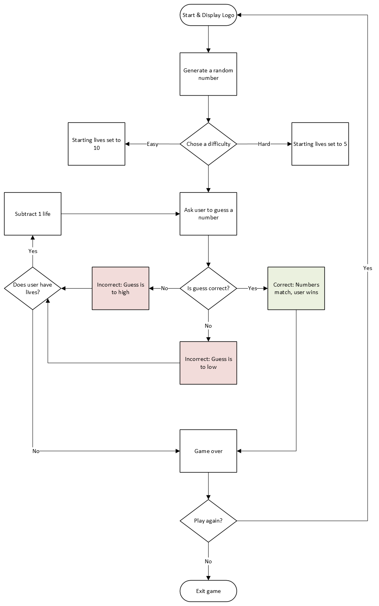

# Day 12 Project: Number Guessing Game
## Lesson Overview
For day 12 of the 100 days of code the end goal is to create a number guessing game. Leading up to that project, the lesson covers a few new topics. These topics indlude:
- Global and local scope
- Modifying global variables within a function
- Constants
## Project
### Modules Used
The Number GUessing Game uses the following modules:
- Random module - Module is used to select a random integer.
### Project Walk Through
Compared to the Day 11 capstone project, this project is far simpler. This project aims to create a number-guessing game where the user has to guess the number that was selected. 

The game first starts out by selecting a random number between 1 and 100 using the **random module**. The user is then asked to select a difficult. If the user selects easy, the user starts off with 10 attempts to guess the random number. If the user selects hard, the user starts off with 5 attempts to guess the selected number.

The game then proceeds to enter a while loop that will ask the user to guess the number. If the user selects a number that is greater than the selected number, then they are informed that the number is too high, and a guess attempt is deducted. This is a similar outcome if the number is lower than the selected number and the user is prompted to guess again. This loop is exited if the user guesses the correct number or the user runs out of guess attempts.

To start, all of the gameplay was created outside of a function but then moved into a function called **number_guessing_game**. After testing, the function was then moved into a while loop to execute again if the user wanted to replay the game.

### Flow Chart
