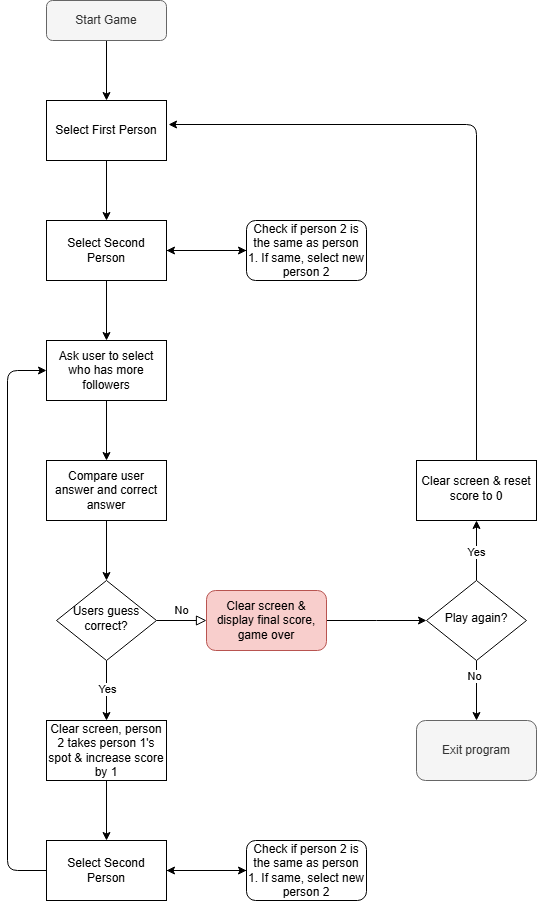

#  14 Project: Higher/Lower Game
## Lesson Overview
For day 14 of the course, the goal was to recreate the Higher/Lower Game. However, instead of using search results for comparisons, this project uses social media followers. 
This lesson did not introduce any new concepts. Instead, this lesson provided additional practice with all the concepts covered in the previous lessons.
## Project
### Modules Used
-   **Random** – Used for selection of persons
-	**OS** – used to clear the screen
### Project Walkthrough
This project probably could have been created with a bit less functions, however, I chose to create functions for the separate functionalities of the game.
-	The **clear_screen()** function is self-explanatory and takes care of clearing the screen when called.
-	The **unique_choice()** function ensures that there are not duplicate choices selected from the game data. The two people are selected at random. However, to ensure that they are not duplicates, this function is called to ensure that person 2 is not the same as person 1. If they are the same, another random person is selected for person 2.
-	The **play_game()** function is the meat of the functions created. It oversees displaying the ascii art, the selected persons, and prompting the user to guess who has more followers.  This function also calls on the compare_follower function to check the user’s answer.
-	The **compare_followers()**function checks to see if the user selected the right answer. Within this function, the follower counts of both people are compared to see who has more followers. The user’s answer is then compared to check if they selected the right individual. 

***Putting it all together…*** The game starts off by displaying the game’s ascii logo, the first selected person and a short description of the account, the second selected person and a description of their account and the user is prompted to select which person’s account has more followers. The user playing the game is not given any hints as to who has more followers, so the user has to make an educated guess as to which account has more followers.

After the user selects an answer, that answer is then compared within the compare_followers function to see if their answer is correct. If the answer is correct, the second person becomes the first person, and a new account is selected for person two. The user’s score is increased by 1 and the user is then prompted again to select which account has more followers.

This process is repeated within a while loop and continues to repeat until the user gets the answer incorrect. 

If the user’s answer is incorrect, the while loop is broken, and they are informed that the game is over along with their final score. The user is then asked if they would like to play again. If the user selects no, the program is exited. If the user selects yes, the user’s score is reset, the screen is cleared, and the game starts over from the beginning. 
### Flow Chart
