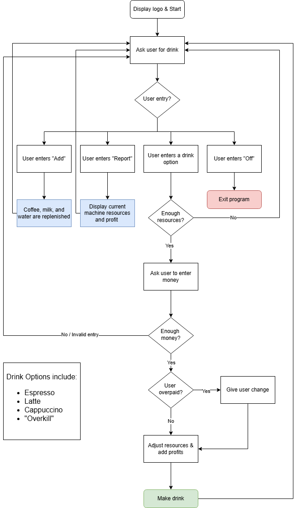

# Day15: Coffee Machine Project
## Lesson Overview
Day 15 of the 100 Day of Code course did not introduce any new concepts. However, this day did build on key lessons learned earlier in this course. Primarily, the goal of this lesson was to break down a complex problem into smaller, easier to work features.
## Project
### Modules Used
This project did not use any of the built in Python modules. A good feature that I experimented with was using os to clear the screen but I decided to omit that since that feature was not necessarily beneficial.
### Key Functions
This project’s main goal was to provide more experience in breaking down complex problems into smaller tasks. To accomplish this, the following functions were created to achieve the programs functionality.
-	***Report** – creates a report of resources.
-	**Check_resources** – ensures sufficient resources are available.
-	**Subtract_resources** – adjusts resources as needed.
-	**Add_resources** – adds resources to the coffee machine.
-	**Process_coins** – returns the sum of the coins that the user enters
### Project Walkthrough
Along with the functions described above, the program also starts out with a couple of dictionaries:
-	**Menu** – list s the menu options avaialble to the user along with the items price and resources required.
-	**Resources** – The resources dictionary lists the starting resources for the coffee machine. Any time a drink is made, resources are adjusted accordingly. Additionally, if resources are added, the values in this dictionary are updated.

Outside of the function exists a variable called **money**. This variable is updated every time a drink is sold. 

The coffee machine program exists within a while loop, representing the machine in an on function. The coffee machine then prompts the user to make a choice for what drink they would like to create. The user has a few options here. Below are the options available to the user to choose from: 
-	**“Espresso”**, **“latte”**, **“cappuccino”**, and **“overkill”**. The overkill drink was used for testing to see if sufficient resources are present to create a drink without modifying the starting resources.
-	If the user enters **“report”**, a report is generated of the available resources including money.
-	If the user enters **“add”**, additional resources are added to the coffee machine.
-	If the user enters **“off”** or **“exit”** the coffee machine is turned off and the while loop is exited.

If the user selects a drink, the program checks to make sure that the coffee machine has sufficient resources to make the specified drink. If the machine does not have enough resources, the user is prompted again to select a drink.
If the machine has sufficient resources, the user is prompted to add coins using the process_coins() function. If the user does not enter enough coins or enters an invalid value, the user is informed and is prompted to select a drink again.

If the user did enter enough coins, the program proceeds to make the drink. However, the coffee machine first checks to see if the user entered more coins than necessary for the drink. If this is the case, the user is informed that they have change before proceeding. After validating the resources, and processing the money, the user is then informed that their drink has been created and repeats this loop of asking the user to select a drink. However, if the user made it this far, then they make it out with their drink! ☕

### Flowchart
