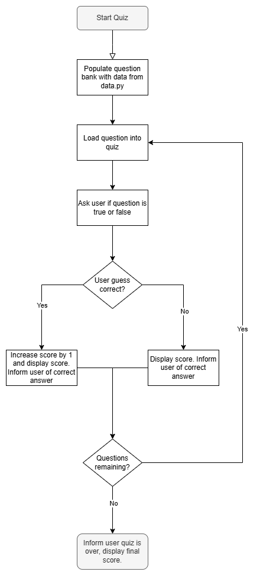

# Day 17: Quiz Game
## Lesson Overview
Lesson 17 of the course expanded on object-oriented programming. Whereas day 16 had prewritten classes to work with. Day 17 involved creating classes from scratch. This included setting attributes and creating methods within the class. By the end of the Quiz game project, the classes created were all tied into the main.py file to make the project work.
## Project
### Files
#### Data.py
Data.py holds a list that is composed of dictionary entries that are imported into the question bank.
#### Main.py
Main.py is where the question bank is created, and the quiz is started and played. This file imports the relevant data from the other three Python files. 
#### Question_model.py
Question_model.py is used to take data and format it into the question format.
#### Quizbrain.py
**Quizbrain.py** is responsible for controlling all aspects of the quiz. This includes keeping track of the user’s score and keeping track of how many questions are in the question bank. Inside the **QuizBrain** class, there are additional methods for controlling the flow of the quiz. **Still_has_questions()** is used to keep track if the quiz still has questions remaining. **Next_question()** pulls up the next question in the question bank. **Check_answer()** is used to check if the user’s answer is the correct answer.
### Project Walkthrough
The quiz game project first starts by populating the quiz data from data.py into the **question_bank** variable. Data is first formatted using the **Question** class from the **question_model** file and then appended to the question bank.

After the question bank is created, the question bank is loaded into the **QuizBrain** and the quiz is started. 

**QuizBrain** then loads the first question in the question bank and prompts the user to select if the question is **True** or **False**. If the question is correct, the user’s score is increased by one point. Otherwise, the user’s score stays the same. The user is also informed of the correct answer regardless of whether the user got the answer correct or not. The next question is then loaded and displayed to the user and the same process is repeated until the user has looped through all the questions.

Once finished with all the questions, the user is informed of their final score, and the quiz is exited. 

### Flowchart
