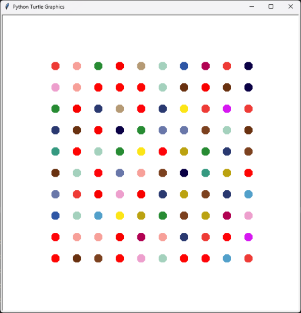

# Day 18: Hirst Painting
## Lesson Overview
Day 18 of the 100 Days of Code course introduced the concepts of installing external libraries and working with the built in Turtle Graphics library. To start out the day, the lesson started out by completing various challenges in Turtle Graphics to achieve a desired output.

Here is bullet points of the topics covered today:
- Turtle Graphics
- Reading online documentation
- Tuples
- Installing external libraries
- Virtual envirnments
## Project

Compared to the previous couple of projects in this course, this one was a bit more linier to follow along. The main goal in this lesson was to work with utilizing module’s documentation to achieve an end goal.

To start out, the **Colorgram** library  was used to generate a list of rgb colors that were pulled from an image passed through it. The output wasn’t quite right for how Turtle Grapcis wanted it formatted so additional formatting needed to be done. Once formatted correctly, the Colorgram output was copied from the terminal into the **color_list** list. There were a few tuples removed as the closer all three numbers were to 255, the safer it was to assume that it was a background color (shades of white).

With the list of colors obtained, the section working with Colorgram was commented out as it was no longer necessary to run that code.

The next step in this project was to use **Turtle Graphics** to generate a picture of randomly colored dots. This process required a bit of playing around to achieve the desired result. Here are some of the areas that need to be tweaked to achieve the desired result.
- Changing the starting position so the dots are all placed on screen
- Painting 10 evenly spaced dots on the screen
- Generating 10 rows of dots without them being cut off the screen.

To achieve these goals, the most important thing was to find a good starting position for the dots to begin. Once found, a couple of for loops were used to generate the 10x10 grid and paint the picture!
