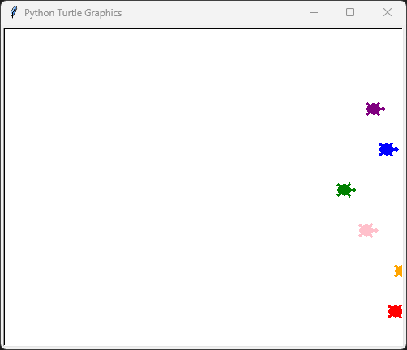
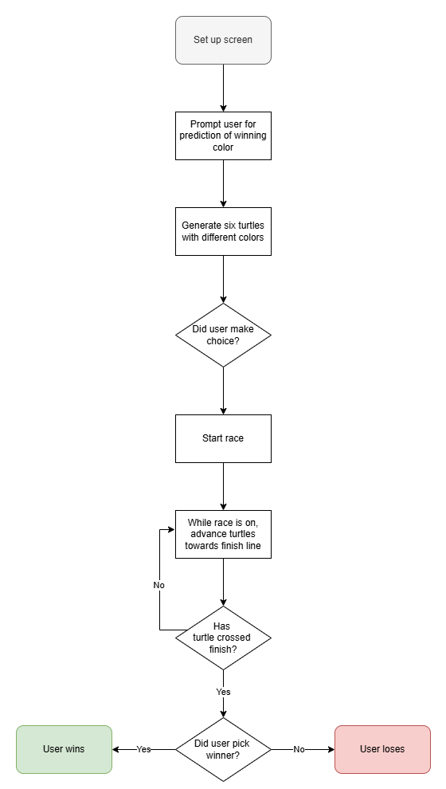

# Day 19: Turtle Races
## Lesson Overview
Day 19 builds on the previous work completed with Turtle Graphics. Today's lesson introduced the following concepts:
-	Event listeners
-	Higher order functions – functions that work with other functions. Functions that take a function as an input and trigger that function
-	Working with separate instances
-	Instance states
## Project

### Project Walk Through
Modules used in this project include the following:
- Turtle Graphics
- Random

The project starts by setting up the screen dimensions, which are set at a width of 500 pixels and a height of 400 pixels. The user is then prompted to select the color of the turtle they believe will win the race. This entry is saved in a variable which will be used later in the program

The next step in the program is to generate six turtles with different colors and starting positions. The colors are assigned based on the colors available in the **colors** list and the starting y-coordinate is defined in the **starting_y** variable. A for loop is used to create the turtles based on the index of the colors list and space the turtles out by 50 pixels. The turtles that are created are then appended to a list called **turtles**.

After the turtles are created, the turtle race is ready to begin! A while loop is used to carry out the turtle race. Until one of the six turtles crosses the specified x-coordinate, the turtles advance at a randomized increment of 1 to 10 steps. When the while loop is broken, the **user’s choice** is compared to the **color of the turtle** that won the race. If the user’s choice matches the turtle's color, then they win. If the choice does not match the color of the turtle, the user loses.

### Project Diagram

