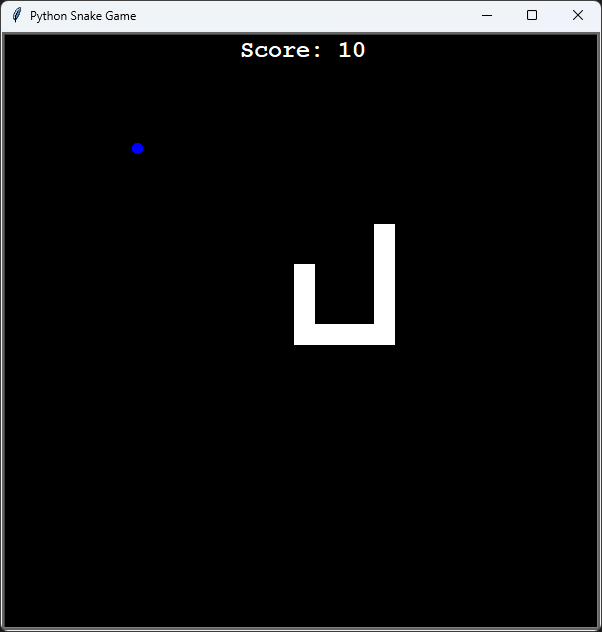
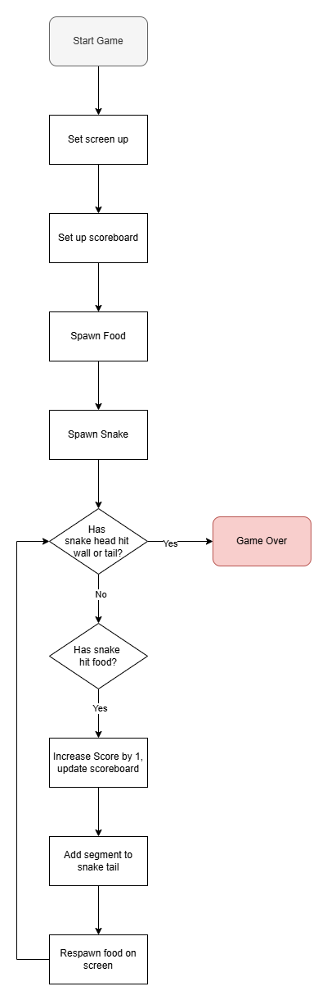

# Day 20 & 21: Python Snake Game
## Lesson Overview
The snake game project was divided over two days. Day 20 focused on creating the screen, creating the snake, and moving the snake around. Day 21 focused on spawning the food object, keeping track of the scoreboard, extending the snake's body and detecting collisions with the walls and the snake's body.

This lesson did touch on a few new concepts that were introduced to the final project:
-	Class Inheritance
-	List (and tuple) Slicing 

Outside of those two concepts, this project further expanded on the importance of breaking down a complex project into manageable components. Once functionality was broken down, the project was far easier to tackle. 
## Project

### Modules Used
-	**Turtle Graphics** – Used for screen and game setup
-	**Random** – Used to spawn the food object randomly 
-	**Time** – Used for updating the screen
### Project Files
#### Food.py
The **food.py** file contains the Food class. The **Food** class is responsible for spawning the food object on the screen. The object spawns on a random location on the screen when the game starts and is respawned when it makes contact with the snake object.
#### Main.py
**Main.py** is responsible for the gameplay of the Snake Game project. The file imports all the necessary modules and libraries, sets the screen up, creates the scoreboard, food and snake objects, and binds the keys used to move the snake. The file then proceeds to carry out the game as long as the user has not hit a wall or the snake’s tail.
#### Scoreboard.py
**Scoreboard.py** is responsible for displaying the current score of the game. The scoreboard starts at a score of 0 when the game starts. The **Scoreboard** class contains three methods: update_scoreboard, increase_score and game_over. **Update_scoreboard** and **increase_score** are used to keep track of the current score and display it on the screen. **Game_over** is called when **game_is_on’s** value is switched to False and informs the user that the game is over. 
#### Snake.py
**Snake.py** is responsible for creating the snake object and controlling its movements. When the snake object is created, the snake is created with three body segments. These segments are increased anytime the snake contacts the food object. The **Snake** class also has methods defined for moving the snake and changing the snake’s movement direction.
### Project Walkthrough
The project first starts by importing the necessary modules and libraries. 

Afterwards, the **screen** object is set up using the **Screen** class from the **Turtle** module with the dimensions of 600x600 pixels. After the screen is set up, the **scoreboard**, **food**, and **snake** objects are created. The last thing to set up is to bind the arrow keys to control the snake's movement. The functions used to control the snake's movement are pulled from the **Snake Class’s** movement methods (up, down, left, right).

Once the game is set up, the game play logic is ready to proceed! The **game_is_on** variable ensures the game runs if the variable’s value is set to **True**. **Game_is_on** has its value changed to **False** when the snake hits a wall or collides with its own body. If these conditions are met, the game is ended, and the user is informed that the **game is over**. 

If the user has not hit a wall or themselves, the snake is continuously moving and can change directions based on the arrow key pressed by the user. While the snake is moving, the game checks to see if the user hits the food object. If the user does hit the **food** object, the **food** object is respawned, the **scoreboard’s** value is increased by 1, and a segment is added to the end of the snake’s body. This logic is repeated until a user meets a condition that would end the game.

### Project Diagram 

