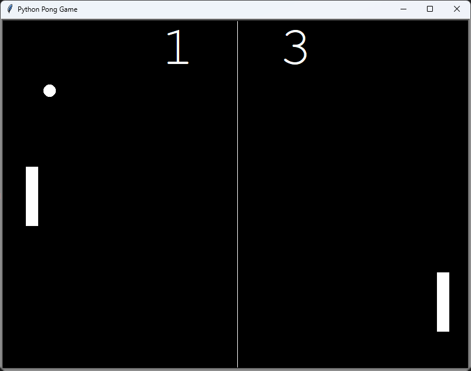
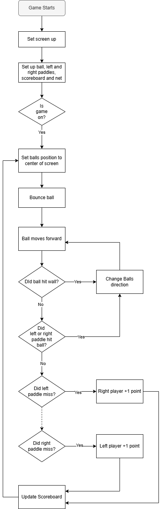

# Day 22: Pong Game

## Lesson Overview
The Pong game provides additional experience working with Turtle Graphics and OOP. The day itself does not introduce any additional concepts, however, it further emphasizes the need to break up complex projects into smaller manageable components.
## Project
### Modules Used
**Turtle Graphics** - Turtle Graphics is used to display the screen and create the game objects including the paddles, ball, and scoreboard.
**Time** - The time module is used to control the speed of the ball.
**Random** - Random is used to randomize the ball's direction when the game starts.
### Project Files
#### Ball.py
The **Ball** class is used to manage the ball object used in the Pong game. The ball class has the following methods which are used to control the functionality of the ball. The **starting_bounce** method randomly chooses the starting direction of the ball. **Move** moves the ball forward. **Bounce_y** and **Bounce_x** change the direction of the ball's movement, and the **reset** method moves the ball back to the center of the screen.
#### Main.py
**Main.py** ties the entire game together and is elaborated on in the **Project Walkthrough** section. Main.py imports all the necessary modules, sets up the objects and controls the game loop.
#### Paddle.py
The **Paddle** class is used to create a **paddle** object. The object itself takes an input that determines the position of the paddle that is created. The class also has two methods used to move the paddle up and down.
#### Scoreboard.py
**Scoreboard.py** has two classes inside of it, Scoreboard and Net.

The **Scoreboard** class is used to create aspects of the game’s scoreboard including keeping track of the points scored by the users and updating the scoreboard anytime a point value is changed.

The **Net** class is simple and is only called to create a line in the middle of the screen. The class is optional and only provides cosmetic value.

### Project Walkthrough
The pong game first starts by importing the necessary modules. After importing the modules, the next step in the game is to set up the **screen**, **ball**, **right paddle**, **left paddle**, **scoreboard**, and **net** objects. Those objects are created from the files outlined in the Project Files section. Additionally, the **screen.onkey** method is used to bind the movement of the left and right paddles to the specified keys.

With the game setup complete, the game is ready to proceed.

The game first starts by bouncing the ball in a random direction. The ball continues to move forward until one of the following conditions is met:
-	The ball hits a wall
-	The ball hits a paddle
-	A player misses the ball

If the ball hits a wall or one of the paddles, the direction of the ball is reversed. Additionally, if the ball hits a paddle, the ball’s speed increases slightly and continues to increase if the ball contacts a paddle.

When a player misses the ball and the ball goes off screen, the ball’s position is reset to the center of the screen, the ball’s speed is reset to its starting speed and the ball bounces again. In addition, if the left player misses the ball, the right player is awarded a point. If the right player misses the ball, the left player gets a point. The scoreboard is also refreshed to reflect the updated score.

This logic is repeated until the player hits the exit key on the window that pops up.

### Project Flow Chart

