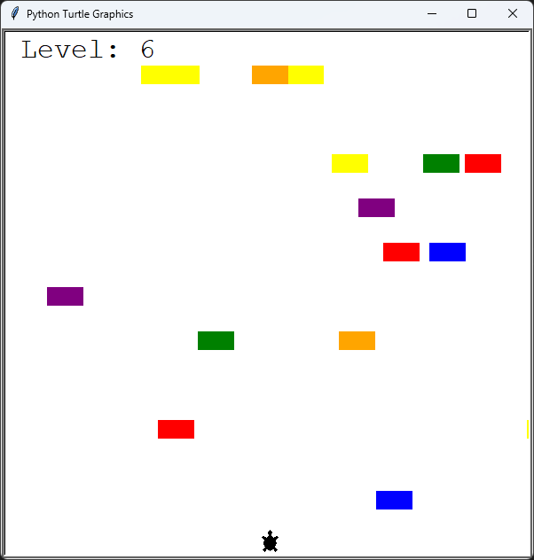
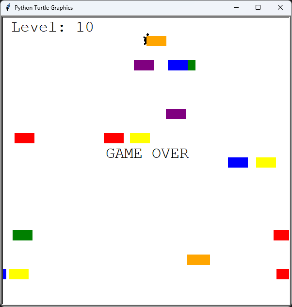
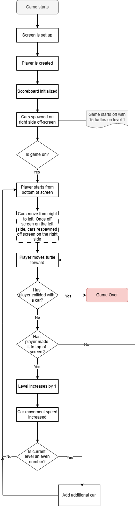

# Day 23: Turtle Crossing Capstone

## Lesson Overview
The Turtle Crossing project is the second capstone project in this course. The project tests one’s abilities in the content covered in the previous lessons. Below are some of the areas that this project really touched on.
-	Breaking down complex problems into smaller chunks
-	Understanding programming logic
-	Working with Turtle Graphics
-	Utilizing Object Oriented Programming
## Project
### Modules Used
**Random** - Random is used to specify a random starting x and y coordinate for a car when the car is spawned off screen. Doing so ensures that cars are spaced apart randomly.

**Time** - The time module is used to control the update speed of the screen.

**Turtle graphics** - Turtle graphics is used to create the screen and the various objects used in the game including the turtle, cars, and level counter.

### Project Files
#### Car_manager.py
**Car_manager.py** contains two classes, **Car** and **CarManager**.

The **Car** class is used to create a singular car object. When a car object is created, it is assigned a random color and a random starting x and y positions. This ensures that the cars are spaced out when moving across the screen.

The **CarManager** Class manages the list of cars created in the game. When the CarManager class is first called, 15 cars are created. The CarManager class has three methods. **Create_car** is used to create a singular Car object. This method is used to create the 15 cars when CarManager is created. **Move_cars** moves cars across the screen. **Increase_speed** increases the car's speed when the player levels up.
#### Main.py
**Main.py** ties everything together. The required modules are imported, screen and game objects are set up and the file contains the game’s logic. The **Project Walkthrough** section will provide more information on how this file works.
#### Player.py
The **player.py** file contains a single class called Player. The **Player** class is used to control the turtle object that is controlled by the player. The class itself has two methods; **move** which moves the turtle forward when the method is called, and **level_up** which resets the turtles starting position when the turtle makes it to the finish line.
#### Scoreboard.py
**Scoreboard.py** contains a single class called Scoreboard. The **Scoreboard** class is used to display the current level and display “Game Over” when the player crashes into a car object.
### Project Walkthrough
The project starts out by importing the necessary built-in modules and classes from the **car_manager**, **player**, and **scoreboard** files. 

The next step is to set up the **screen** with the specified dimensions, **player**, **scoreboard**, and **car** objects. The cars object calls on the **CarManager** class which is explained under the **Project Files section**. Additionally, **screen.listen** is used to bind the **player.move** method to the up arrow key. This method only allows the player to move forward.

With the necessary objects set up, the game is ready to proceed! The game is tied to a variable called **game_is_on**. When game_is_on has its value changed to False, that is when the game is exited.

The game starts out at level 1 with the player starting at the bottom of the screen. While the game is on, car objects continuously move from the right side of the screen to the left side of the screen. Objects are spawned at random increments to ensure that the player can avoid hitting a car object. Once the cars reach the left side of the screen, they are respawned randomly off screen on the right side.

Once the player reaches the top of the screen, the level increases, the player is sent back to the starting position, and the car's speed is increased slightly. For added difficulty, if the level is an even number (level 2, 4, 6, etc.), then an additional car is added to the list of cars moving across the screen.

This logic is repeated until the player contacts a car object. When the play makes contact with a car object, the words “***GAME OVER***” are displayed on the screen and the **game_is_on** while loop is broken.

### Project Flow Chart

