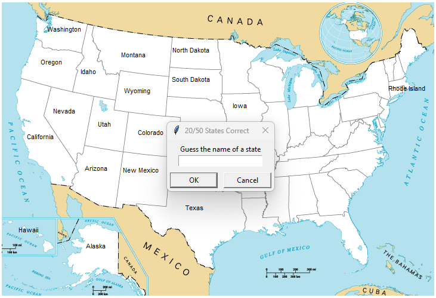
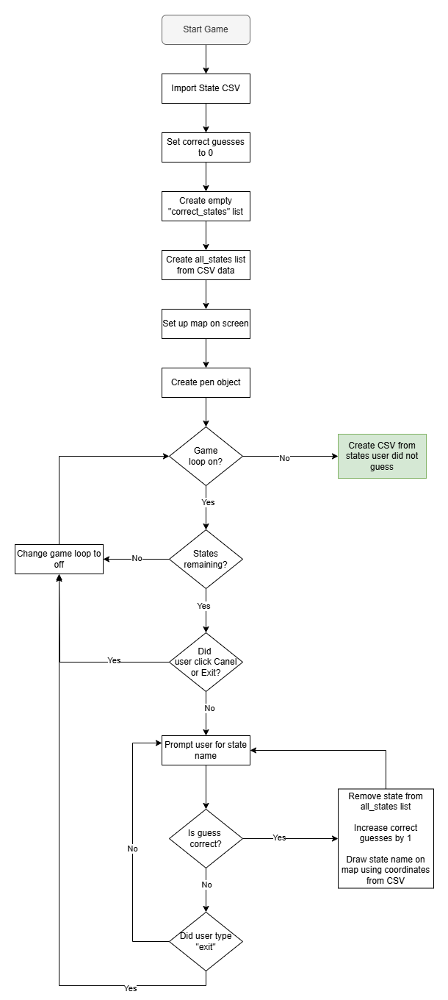

# Day 25: U.S. States Guessing Game

## Lesson Overview
The goal of day 25 in this course is to learn how to work with CSV data using Python.

The lesson starts with two exercises (saved in the **Exercises folder**). The first exercise works with the built-in **csv module**. This exercise then shifts to working with **Pandas**, which is far more efficient and offers more capabilities than the built-in module. Pandas is then used in the second exercise to provide further practice working with the package. 

With the practice exercises out of the way, the lesson shifts to the final project, which is to create a GUI game to guess the names of the states on a map of the United States. That project is covered in the following **Project Section**.

Concepts covered in this lesson include:
- Working with CSV files
- Using the csv module
- Introduction to the Pandas module
    - Opening csv files
    - Working with csv data
    - Creating lists, dictionaries, and data frames
    - Creating a CSV file with Pandas
- Adding image files (gif only) to Turtle Graphics

## Project
### Modules Used
#### Turtle Graphics
**Turtle Graphics** was used in this project to display the gameplay map, prompt the user to guess a state name, and write state names on the map. The map is no longer displayed on the screen when a condition is met (Exit or cancel button pressed, user types exit, or all states guessed).
#### Pandas
The **Pandas** module is used to open the 50_states CSV. The data from this CSV is used to get the list of states and the states' coordinates. Pandas is also used to create a CSV from the state names the user was unable to guess.
#### Datetime
Datetime is an added touch to this project. **Datetime** is used to append the date and time to the CSV file that is created at the end of the project, containing the states the user did not guess. This ensures a new CSV is created to track how the user has improved on guessing the state names.
### Project Walkthrough
The program first starts by importing the necessary libraries and modules. Afterward, the necessary variables used in the program are created. The variables used to keep track of the following functionality: 
- Getting the date format
- Importing the **50_states.csv** file with pandas 
- Keeping track of the user’s correct guesses
- A list to hold the states the user guessed correctly
- A list that contains all the state names from the imported CSV file

Along with those starting variables, the program has a single function to check if the user guessed the state name correctly and get the state coordinates on the map image file. If the user’s guess matches a value in the **all_states list**, then the user guessed a state’s name correctly! The state’s name is then used to match the row in the CSV with the corresponding X and Y values for the state. These X and Y values are then returned and used as coordinates for Turtle Graphics.

The next steps in the project setup are simple. The screen is set up with the **blank_states_img.gif** file as a background and a pen object is created. The pen will be used to write state names on the onscreen map. 

With the setup complete, the game is ready to proceed!

The game continues in a while loop that stays true as long the user has **not answered all 50 state names**, typed **“exit”** for an answer, or clicked on the **cancel** or **exit** buttons on the pop-up window.

If the user types anything other than exit, the user’s answer is checked. If the state matches the name of a state in the *all_states* list then the state is removed from the **all_states list** and added to the **correct_states list**. The state’s coordinates are returned using the **check_state_in_csv function** and are used by the **pen object** to write the state on the map. Additionally, the **correct_guesses variable** is increased by 1. This variable informs the user how many states they have guessed correctly in the title of the text input box and is refreshed after every guess. If the user enters an invalid entry in the text box, then the text box refreshes, and the user is prompted again to enter an input.

Once the game loop is exited, the program creates a CSV file of the state names the user did not guess correctly. First, a dictionary is created using the remaining values in the **all_states list**. Next, **Pandas** is used to create a data frame from the dictionary and then convert the data frame to a CSV file. The CSV file generated will always be unique since a timestamp is added to the file’s name. This can be used to track historical progress in the game!

### Project Flowchart 
