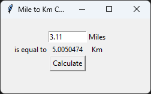

# Day 27: Unit Converter GUI App
## Lesson Overview
While the previous GUI-related projects used **Turtle Graphics**, day 27 introduced the built-in **Tkinter** module. In addition to working with Tkinter, the lesson touched on advanced argument concepts. Below are some of the concepts covered in Day 27.
- Tkinter introduction
    - Setting up the window
    - Working with widgets
    - Object placement on window (pack, grid, place)
- Advanced arguments
    - Arguments with default values
    - Keyword arguments
    - Unlimited positional arguments - *args
    - Unlimited keyword arguments - **kwargs

# Project

This project was relatively basic and served as an introduction to working with Tkinter. The most challenging part was placing the objects in their desired position on the grid.

As for the project itself, the project first sets up the window and required widgets.
- Labels to inform the user of what is being displayed
- User entry
- Calculate button

When the user clicks on the **calculate button**, the **convert function** is called. The convert function takes the user's input in the **user_input entry box**. This value is then multiplied by 1.60934 to get the total kilometer value. The kilometer value is then passed into the **conversion_label label** and displayed on the screen.
