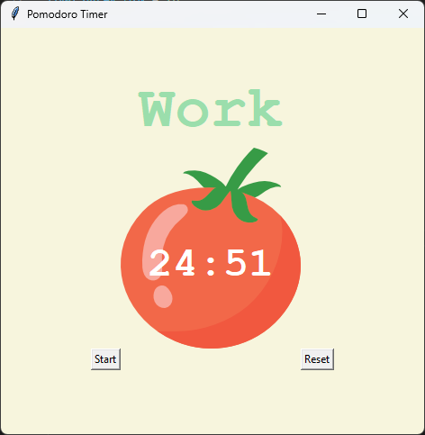
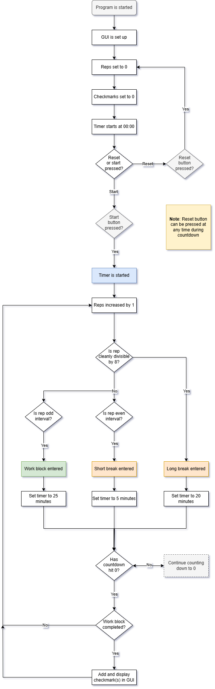

# Day 28: Pomodoro Timer

## Lesson Overview
Day 28 was the second day of the course working with Tkinter. The goal was to create a Pomodoro timer. The lesson started by creating the user interface and adding a background image to the timer. The timer mechanism was handled using Tkinter’s **.after()** and **.after_cancel()** methods.

New concepts introduced in the lesson include:
-	Adding images to a GUI program
-	Tkinter’s **after** and **after_cancel** methods
## Project
### Modules Used
#### Tkinter
**Tkinter** is used in this project to display the timer GUI and control aspects of the program including the countdown mechanism, start, and reset buttons.
#### Math
The **math module** was used to get the total number of minutes remaining in the countdown mechanism. The countdown duration is calculated in seconds but to make the timer display user-friendly, the format is displayed in the format of **MM:SS**.
### Project Walkthrough
The project starts by setting up the GUI. The Pomodoro timer has a label that displays what block the timer is in, a picture of a tomato with the countdown time on it, and two buttons; start and reset.

The timer itself has three work blocks available. When a block is entered, a variable called **reps** increases by 1.
- **Work block** - 25 minutes
    - Entered on odd-numbered reps
- **Short break** - 5 minutes 
    - Entered on even-numbered reps
- **Long break** - 20 minutes
    - Entered on the 8th rep

When the user presses the **start button**, a work block is entered. The **work block** counts down from 25 minutes. Once the timer hits 0 seconds, a **short break** is entered and counts down to 0 seconds. This process repeats for as long as the timer is running. When a rep is cleanly divisible by 8 (8th rep), a **long break** of 20 minutes is entered.

The **start_timer() function** is tied to the start button. This function calls the **countdown() function** which performs the countdown functionality of the program. In addition to counting down the time, **countdown()** displays the current time along with checkmarks, which denote how many work blocks have been completed. Once the countdown hits 0 seconds, **start_timer()** is called again repeating this cycle with **reps** determining what block the user is currently in.

The **reset button** is far simpler. The reset button is tied to the **reset() function** which sets the timer to its default values and settings.

### Project Flowchart

