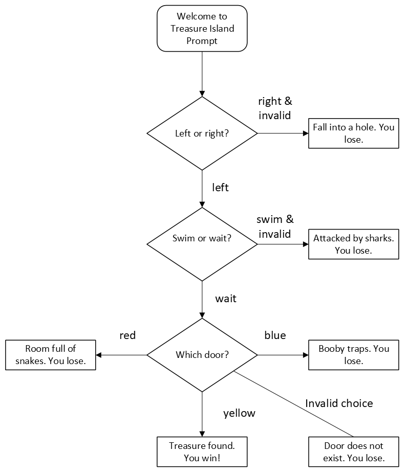

# Day 3 Project: Treasure Island CLI Game
## Topics covered in leason include
- If/elif/else conditional statements
- Conditional operators
- Nested if/else statements
- Modulo operator
- Logical operators
## Project
The project uses user inputs to determine how to progress the game. Using the first character of what the user types, a branch is taken. Using conditional statements, either the user advances in the game, or the game ends with the user losing.
## Diagram
