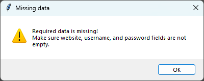
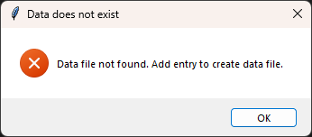

# Day 30: Password Manager Application 2.0

## Lesson Overview
**Day 30** of the course focuses on **error handling**. The project is largely a clone of the **Day 29 Password Manager project** with some added features and error handling included in the project.

Concepts covered during this lesson include:
-	Reading, writing and updating **JSON files**
-	Error handling
    - Using **Try**, **Except**, **Else**, and **Finally**
    - Catching custom errors with **Raise**
    - Specifying specific errors in except blocks

## Project
### Modules used
#### Tkinter
**Tkinter** was used in this program to set up the GUI for the password manager. The GUI had **entry fields** for the **website**, and the user entered the **email** and **password**. In addition to those fields, the program has a button to **Generate** a password for the user and an **Add** button to save the data stored in those fields. 
#### Random
The Random module is used to generate a randomized password for the user. Random selects a random choice of letters, numbers, and symbols. Those values are then shuffled to randomize the password that’s returned to the user.
#### Pyperclip
**Pyperclip** is called when the user clicks on the Generate button. When the user clicks on **Generate**, a randomly generated password is generated and displayed in the password entry box. In addition, using Pyperclip, the password is copied to the user’s clipboard.
#### Json
The **json package** is used to read, write, and update the **data.json** file. In the previous iteration of this project, data was saved to a text file.

### Project Walkthrough
The password manager application first starts out by setting up the GUI. The program includes three entry fields: **website**, **username/password**, and **password**. These fields need to be populated with data otherwise, the user is informed that required information is missing. In addition to the entry fields, the program also includes three buttons: **Add**, which adds the data to a JSON file; **Generate**, which generates a randomized password for the user; and **Search** (added in day 30), which searches the JSON file for the entry provided in the website entry box. 

#### Adding an entry to the Password Manager
The program’s Email/Username field is prepopulated with a generic email address. If any of the fields are left empty when **Add** is clicked, the user will receive the following message until all fields are populated.

If the user enters all the required information and the user clicks **Add**, the data is saved to **data.json**. This differs from the original version of the project where the user was prompted to confirm their entry. In the Day 30 version of this project, there is no message box. The entry is simply added to the JSON file.

After the data is saved, the data entered in the entry fields is cleared and the default username is re-populated to the **Email/Username** field. The user is also informed that the password was saved successfully to the **data.json** file. This process of adding credentials is repeated until the user exits the program.

#### Searching for an entry in the Password Manager
Introduced to the Day 30 version of the password manager is the ability to **search for saved credentials**. 

If the user clicks on **Search** credentials and the **data.json file does not exist**, the user will receive the following error message. If the user has previously saved a credential to the program, then the JSON file will have been created.

If the user searches for a credential **and the file exists**, the user will receive one of the following messages. If the credential does not exist in the JSON file, the user will be informed that the credentials cannot be found. If the credentials do exist in the JSON file, the saved credentials are returned in the message box that is displayed.

#### Generating a random password
The password manager program has an additional feature of generating a strong secure password for the user. By default, the user can enter any password they want to use in the password field. Even passwords that are not strong. When the **Generate** button is clicked, a randomized password is created (utilizing the code from **day 5** of the 100 days of code course). The password that is generated is then populated into the Password box. In addition, the password is also copied to the user’s clipboard (**Pyperclip**) allowing them to use the password if they were signing up for a new account!

### Project Flowchart

