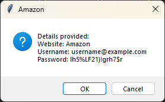

# Day 29: Password Manager Application

## Lesson Overview
**Day 29** of the 100 Days of Code course builds on the concepts covered in the previous **Tkinter lessons** to build a GUI password manager application. In addition to building a password manager, the program adds the ability to create a randomly generated password. This functionality was copied over from **day 5** of the course and modified to work within the Tkinter application.

New concepts covered in Day 29:
-	Stretching items on the Tkinter grid with columnspan value
-	Inserting and deleting data from Tkinter entry boxes
-	Working with Tkinter dialog boxes
-	Using Pyperclip to copy a value to the clipboard
## Project
### Modules used
#### Tkinter
**Tkinter** was used in this program to set up the GUI for the password manager. The GUI had **entry fields** for the **website**, and the user entered the **email** and **password**. In addition to those fields, the program has a button to **Generate** a password for the user and an **Add** button to save the data stored in those fields. 
#### Random
The Random module is used to generate a randomized password for the user. Random selects a random choice of letters, numbers, and symbols. Those values are then shuffled to randomize the password that’s returned to the user.
#### Pyperclip
**Pyperclip** is called when the user clicks on the Generate button. When the user clicks on **Generate**, a randomly generated password is generated and displayed in the password entry box. In addition, using Pyperclip, the password is copied to the user’s clipboard.
### Project Walkthrough
The password manager application first starts out by setting up the GUI. The program includes three entry fields: **website**, **username/password**, and **password**. These fields need to be populated with data otherwise, the user is informed that required information is missing. In addition to the entry fields, the program also includes two buttons: **Add**, which adds the data to a text file, and **Generate**, which generates a randomized password for the user.

The program’s Email/Username field is prepopulated with a generic email address. If any of the fields are left empty when **Add** is clicked, the user will receive the following message until all fields are populated.

If the user enters all the required information and the user clicks **Add**, the user will be prompted to confirm they are satisfied with the data entered. If the user clicks **Cancel**, they are returned to the main Password Manager window to edit their entry. If the user clicks **Ok**, the password is saved to the **data.txt** file.

After the data is saved, the data entered in the entry fields is cleared and the default username is re-populated to the **Email/Username** field. The user is also informed that the password was saved successfully to the **data.txt** file. This process of adding credentials is repeated until the user exits the program.

The password manager program has an additional feature of generating a strong secure password for the user. By default, the user can enter any password they want to use in the password field. Even passwords that are not strong. When the **Generate** button is clicked, a randomized password is created (utilizing the code from **day 5** of the 100 days of code course). The password that is generated is then populated into the Password box. In addition, the password is also copied to the user’s clipboard (**Pyperclip**) allowing them to use the password if they were signing up for a new account!

### Project Flowchart

