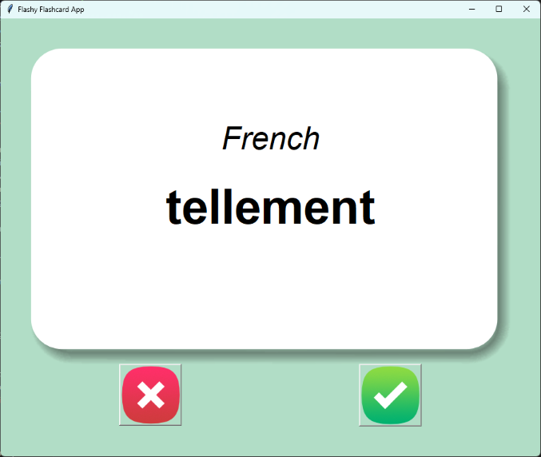
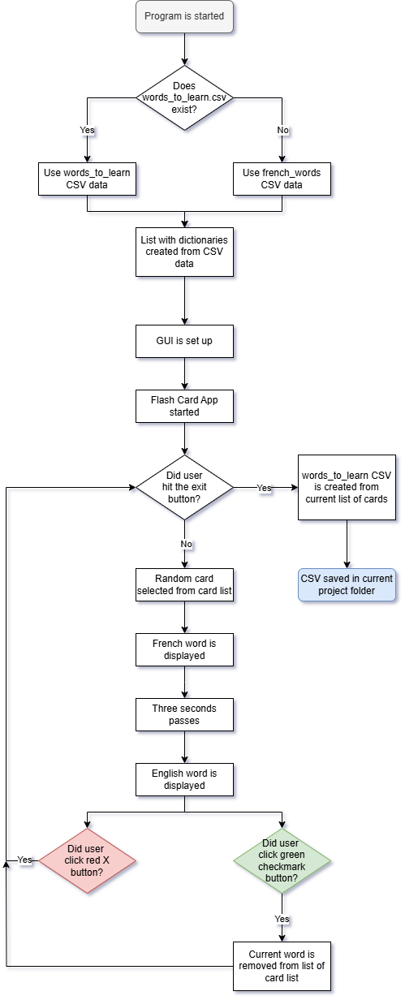

# Day 31: Flash Card App Capstone

## Lesson Overview
The Day 31 capstone project provides an opportunity to demonstrate the knowledge gained by working with CSV files, Tkinter, and Pandas. The project is completed in three steps:
-	Set up the GUI
-	Configure the flash card apps functionality
-	Save data to a CSV

## Project
### Modules Used
#### Pandas
The **Pandas** module is used in this project to interact with the CSV data located in the data folder. 
#### Random
**Random** is used to select a random choice from the list of flashcard words.
#### Tkinter
**Tkinter** is the star of the show, and is used to set up the program's GUI. Tkinter also controls the functionality of the program, including displaying words, getting the next word, and removing words that are known from the word list.
### Project Folders & Files
#### Data Folder
The data folder contains the csv data needed to run the flashcard application. The program starts with a **french_words.csv** file that is used to load the initial list of flashcard data. If the program has been run in the past, **words_to_learn.csv** is used. This CSV file is created when the flash card app is exited. The data from this file contains only words that the user does not know.
#### Images Folder
The image folder contains the image files used for the GUI. Images include the front of the flashcard, back of the flashcard, and button images.
### Project Walkthrough
When the program is started, the required modules are loaded, and constants are set. The next step is to load the CSV data used for the flash cards. The program checks to see if the **words_to_learn.csv** file exists. If that file exists, data from that file is used for the list of flash cards. If that file does not exist, **french_words.csv** is used for the list of flash cards. Pandas is then used to create a list of dictionaries from the CSV data that is loaded.

After the word bank is created, the GUI is set up. The GUI contains the following components.
-	The **front of the card** displays the French word.
-	The **back of the card** displays the English word.
-	The **red X button** is clicked by the user if they are not sure what the word translates to.
-	The **green checkmark button** is clicked when the user knows what the French word translates to. 

With that, the program is ready to start!

The flash card app starts by selecting a random word from the list of words. This is accomplished using the **next_card() function**. When a word is first loaded, the French word is displayed. After three seconds, **flip_card()** is used to display the English translation of the selected word. 

The user has three options for how the app proceeds. 
1.	 If the user clicks the **red X button**, a new random word is selected from the list of cards without the current word being removed from the word list.
2.	 If the user clicks on the **green checkmark button**, **correct_answer()** removes the current word from the list of words, and a new randomly selected word is displayed. This process is continued until the user clicks on the exit button. 
3.	 When the user **exits** the program, Pandas is used to create the **words_to_learn.csv** file. This new CSV file only contains words that the user does not know. As the user clicks on the green checkmark button. The list of words to learn is shrunk. The remaining list is what is saved to the words_to_learn.csv file. This file is then loaded the next time the program is started.

### Project Flow Chart
