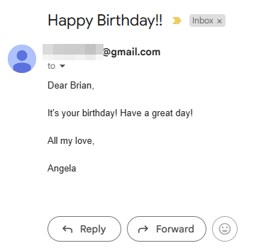
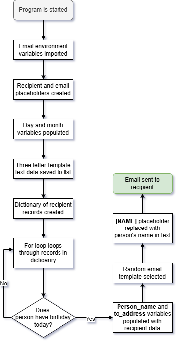

# Day 32: Automatic Birthday Wisher Email
## Lesson Overview
Day 32 of the 100 Days of Code course focuses on working with two new libraries:
-	Smtplib
-	Datetime
These libraries are used in practice and projects to send emails and work with datetime values. The day starts with practice, working with smtplib and sending motivational quotes via email on a specified day of the week. After this practice exercise is complete, the main project of this day is to create an automated birthday wisher email.
## Project
### Modules Used
#### OS
Although not part of the lesson, **OS** was used to access environment variables used for the email and password variables.
#### Pandas
**Pandas** is used in this project to work with the CSV file and transform the data into a workable dictionary. The birthdays.csv file contains numerous entries, including their name, email, and birthday. That information is loaded with pandas.
#### Smtplib
**Smtplib** is the focus of today's lesson, and the module was used to send a happy birthday email to a recipient.
#### Datetime
**Datetime** was used to get the current date. In particular, the current day and month. If there was a match for the current day and month with an entry in the CSV file, then that person has a birthday today, and they will receive an email wishing them a happy birthday!
#### Random
The **random** module was used in this project to get a random letter template from the list of templates. This ensures that the recipient does not receive the same message multiple times.
#### Dotenv
**Dotenv** was used in conjunction with the OS module to access environment variables used in the project.
### Project Walkthrough
The goal of today's project is to create an automated birthday email messaging program. Although not required at this point in the course, after importing the necessary modules, I used environment variables for the email and app password used in this lesson. 

After acquiring those environment variables, several other variables were used to get place holders for the recipient's name, email, and date values.

The project folder contains three text template files located in the **letter_templates folder**. Those template files were opened and saved to the **letter_templates list**.

With the templates saved, the program proceeds to check if a person in the **birthdays.csv** file has a birthday on the current day. For testing purposes, an entry's month and day values were modified to reflect the current date. Using **Pandas**, a list of dictionaries corresponding to records in the CSV file is created. A For loop is then used to go through each of those records, and if there is a match for the current day and month, that entry’s name and email are assigned to the **person_name** and **to_address** **variables**.

The next step in this program is to compose the email to send. **Random.choice()** is used to select a random email template from the **letter_templates list**. The **“[NAME]”** placeholder is replaced with the value of the **person_name variable**.

The last step in this program is to send the email to the recipient. With all the required information gathered, **smtplib** is used to send an email to the recipient. The recipient receives an email wishing them a happy birthday, such as the one depicted below! 

### Project Flow Chart

