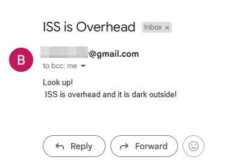

# Day 33: ISS Overhead Tracker

## Lesson Overview
Day 33 of the course served as an introduction to working with **APIs**. The lesson provided practice with working with three separate APIs. New concepts covered in Day 33 include the following:
-	Working with API and API Endpoints
-	Using the Requests module
-	Interpreting response codes
-	Working with API parameters

## Project
### Modules Used
#### OS
**OS** is used in this module to access environment variables used for the email and password values.

#### Smtplib
**Smtplib** is used to send an email if the ISS is overhead, and it is nighttime.

#### Requests
**Requests** is used in this project to query the ISS API endpoint and the sunrise/sunset API endpoint.

#### Time
The **time** module was used to run this script every minute. Once the script is started, **time.sleep()** executes the if block every 60 seconds to see if athe ISS overhead conditions are met.

#### Datetime
**Datetime** was used in this project to assess the current hour. The current hour is used to check if the time is before sunrise or after sunset.

#### dotenv
**Dotenv** was used in conjunction with the OS Module to access environment variables used in the project

### Project Walkthrough
The project first starts by importing the necessary libraries. Additionally, the project starts with the following constants, **MY_LAT**, **MY_LONG**, **EMAIL**, and **PASSWORD**. **MY_LAT** and **MY_LONG** are the user’s current position. **EMAIL** and **PASSWORD** contain the environment variables that are used for **smtplib** to send emails.

The project contains the following functions **check_if_overhead()** and **check_if_night()**. Both of the functions use requests to query the necessary endpoints. 

**Check_if_overhead** is used to compare the ISS’s current position compared to the user. If the ISS position is within 5 for both latitude and longitude, the function returns **True**. Otherwise, **False** is returned.

**Check_if_night** uses the sunrise-sunset API endpoint to check if the current hour is during nighttime. If the current hour is before sunrise and after sunset, then **True** is returned. If not, **False** is returned.

Within a While loop these two functions are executed. If both functions return **True**, then an email is sent informing the user that the International Space Station is overhead. Once executed, this while loop runs the if block 60 seconds until the script is exited. And with that, if you weather and lights are on your side, you may be able to see the International Space Station if it is over your current location at night!
