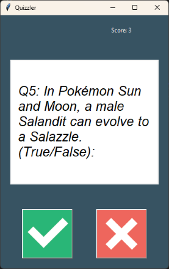
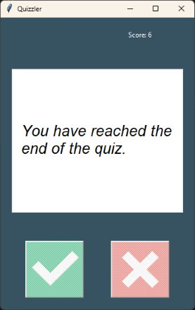
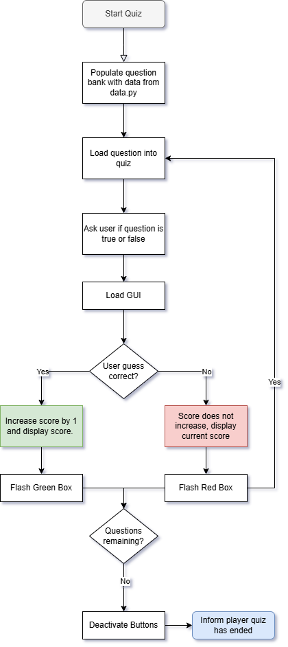

# Day 34: GUI Quiz Application

## Lesson Overview
Today's lesson provided further practice working with Requests, API endpoints, and creating a Tkinter Quiz App that uses classes. The project completed today builds off of the quiz app built in **Day 17** of the course. Below are some of the new concepts covered in the lesson.
-	Un-escaping HTML entities with HTML library
-	Required data types (var: type)
-	Type hints (->)

## Project
### Modules Used
#### Requests
**Requests** is used to query the trivia database endpoint and generate the quiz data.
#### HTML
The **HTML** library is used to un-escape data that is pulled from the trivia database.
### Files
#### Data.py
**Data.py** holds a list of dictionary entries imported into the question bank. The difference in this version vs the version used in Day 17, is that this version uses the opentdb.com endpoint to import quiz data. This adds replayability to the program by loading new question data.
#### Main.py
**Main.py** is where the question bank is created, and the quiz is started and played. This file imports the relevant data from the other Python files. Introduced to day 34, is that the quiz now runs in a Tkinter app (imported from **ui.py**) instead of the CLI.
#### Question_model.py
**Question_model.py** is used to take data and format it into the question format.
#### Quiz_brain.py
**Quizbrain.py** is responsible for controlling all aspects of the quiz. This includes keeping track of how many questions are in the question bank. Inside the **QuizBrain** class, there are additional methods for controlling the flow of the quiz. **Still_has_questions()** is used to keep track if the quiz still has questions remaining. **Next_question()** pulls up the next question in the question bank. **Check_answer()** is used to check if the user’s answer is the correct answer.
#### Ui.py
**Ui.py** is new to day 34 of the Quiz application. Ui.py is responsible for creating the **QuizInterface** class. The class has additional methods to display the current trivia question and control the buttons. The **QuizInterface** class relies on data from **QuizBrain** to control the GUI interface. When the user has looped through all the questions in the question bank, the buttons are deactivated, and the user is informed that the quiz is over.
### Project Walkthrough
The quiz game project first starts by populating the quiz data from **data.py** into the **question_bank** variable. Unlike Day 17, question data for today’s project is pulled from the **Trivia Database API endpoint** instead of data previously saved in the file. Data is then formatted using the **Question** class from the **question_model** file and then appended to the question bank.

After the question bank is created, the question bank is loaded into the **QuizBrain**, the GUI is created using the **QuizInterface class** from **ui.py**, and the quiz is started. 

**QuizBrain** then loads the first question from the question bank and displays it in the quiz interface. The user then clicks on the **green checkmark button** if they think the answer is true. If they think the answer is false, they click on the **red x button**. If the user’s answer is correct, the user’s score is increased by one point. Otherwise, the user’s score stays the same. The user receives an indication that their answer was correct or incorrect by changing the background of the question being displayed to red (incorrect) or green (correct). The background is changed back to white, and the next question is then loaded and displayed to the user. This process is repeated until the user has looped through all the questions.

Once the user has looped through all of the questions, the program's buttons are deactivated, and the user gets a message that the quiz is over!

### Flow Chart
