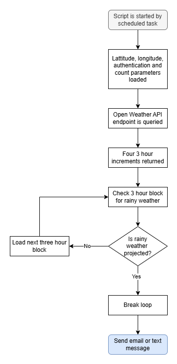

# Day 35: Rainy Day Notifier 
**Day 35 of the 100 Days** of Code provides additional practice working with APIs. The project produced by the end of the lesson is to create a script that sends a notification to take an umbrella if inclement weather is projected during the day. 

Today's lesson also introduces the following concepts:
-	API Authentication & API Keys
-	Environment Variables

## Lesson
## Project
### Modules Used
#### Dotenv & os
**Dotenv** and the **os module** are used for getting the environment variables used in the project.
#### Requests
The **request** module is used in this project to reach the Open Weather API endpoint. 
#### Twilio (or smtplib)
The **Twilio** module is used in this project to send a text message to the number passed in when inclement weather is projected during the current day. Due to validation requirements for the toll-free number provided as part of the project, **Smtplib** is alternatively used to send an email when rain is projected.

### Project Walkthrough
The project starts by importing the modules listed in the Modules Used section. Additionally, the project also loads the following constants and variables
-	**URL** contains the **Open Weather API endpoint** used
-	**TWILIO_ACCOUNT** and **TWILIO_AUTH** environment variables contain authentication information for Twilio.
-	**Parameters** contains the data required by the Open Weather API endpoint.

With the necessary parameters, the Open Weather API endpoint is queried. The endpoint used is the **5-Day 3-hour API endpoint**, which returns weather data every three hours starting at 6:00 AM on the current day over the next five days for a total of 40 entries. 

This data is then parsed to only get the first four entries in the data returned. Since the concern is to see if rain is projected during the day, this ensures only weather data from **6:00 AM to 6:00 PM** is returned. For testing purposes, I copied the output of one of the queries into a static **weather_data variable** and used it for testing to ensure that inclement weather is detected in the JSON data used. 

The script then checks to see if there is inclement weather projected in the 12-hour window. The **weather id key** is used to determine if precipitation is projected. If rain or snow is projected, then Twilio is used to send a text message letting the user know to take an umbrella with them!

And with that, that wraps up the Rainy Day Notifier script. However, there are a few other things needed to enhance this project.
-	This script can be run daily as a scheduled task locally or from an online hosting solution.
-	The **Toll-Free Number** provided during the **Twilio trial period** requires validation before it can be used to send a text message. Alternatively, if you have WhatsApp, you can use the **WhatsApp** sandbox. However, I do not use WhatsApp, and the validation period takes weeks, so I used **smtplib** to send a notification. 

### Project Flowchart 

