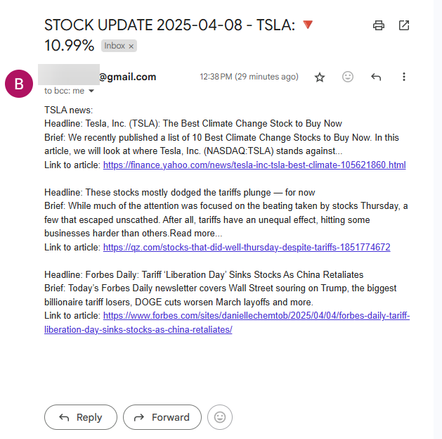
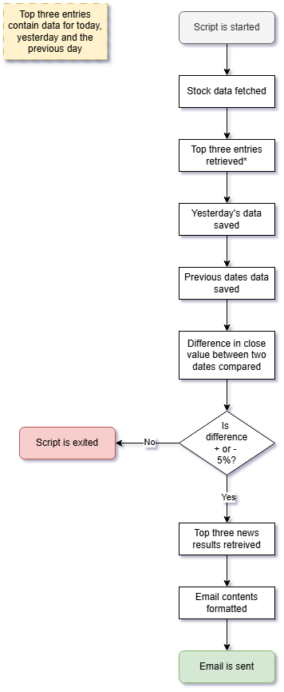

# Day 36: Stock News Notifier

## Lessons Learned
**Day 36 of the 100 Days of Code course** did not introduce any new concepts. However, the goal of the day was to provide additional practice working with APIs and previously covered content such as using **Twilio** (I used **smtplib**) to send an email when a condition is met. 

Additionally, the day had three difficulties to choose from:
-	Normal
-	Hard
-	Extra Hard

For this project, I chose the **extra hard option** when provided minimal data to start the project.
### Potential Improvements
This is a very interesting project and can be modified in many ways. A few modifiers I came up with are to:
-	Schedule the program to run daily
-	Loop through a list of stocks
-	Send a notification daily instead of only if there is a 5% change
## Project
### Modules Used
#### Datetime
**Datetime** is used to get the current date. The current date is used in the subject line of the email that is sent at the end of the script.
#### Dotenv & os
**Dotenv** and the **os module** are used for getting the environment variables used in the project.
#### Requests
**Requests** is used to query the Alpha Vantage and News API endpoints.
#### Smtplib
Instead of using **Twilio**, I ended up using **smtplib** to send an email with news pertaining to the stock that is passed through the **Stock Notification script**.
### Project Walkthrough
The project starts by importing the necessary modules required. The script has the following **constants**.
-	Stock name
-	Company name
-	URLs for the stocks and news APIs
-	Email environmental variables
-	Date information used for email and data comparison

Additionally, the **parameters** passed through both APIs are listed at the top of the script.

With that data, the stocks API is then queried and the necessary data is obtained. To obtain the necessary data, I used a **For loop** to loop through the first three keys in the JSON data that is filtered through. These first three keys contain information for today, yesterday, and the prior day. An **If statement** is then used to obtain the desired data for yesterday and the previous day. 

The next step in the project is to compare the difference in the closing cost for the stock that is passed. The difference between yesterday’s closing cost and the prior day’s closing costs are compared and if that **difference** is **+/- 5%** the script proceeds to gather news articles and send an email. If that threshold is not met, the script is finished running.

Instead of using **Twilio**, I opted to use email for the notification that is sent. The emails’ body is composed of three news articles that are pulled via the **News API** and formatted to get the title, description and URL of the news are pulled. These three articles are then formatted and appended to the email’s body.

Once the email’s subject and body are composed, **smtplib** sends an email to the passed email address. One little note on the email that is sent is that since the email has emojis, the encoding on the message needs to be specified as **utf-8** to send successfully!

### Project Flow Chart

