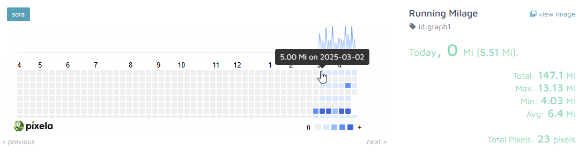
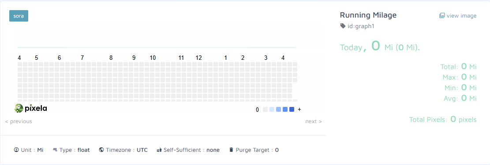
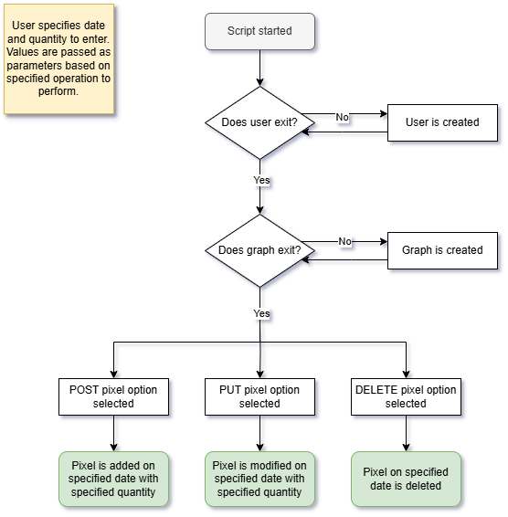

# Day 37: Habit Tracker

## Lesson Overview
**Day 37** of the course provided opportunities to work with the **Pixela API**. The lesson’s focus was to work with Pixela’s documentation to achieve the desired outcomes. Some of the new concepts covered in the day's lesson include:
- HTTP Request types
    - **GET** - Retreive
    - **POST** – Add data
    - **PUT** – Updates content
    - **DELETE** – Deletes content
- Using Strftime to format the date
### Potential Modifications
This project is useful and can be used in real life. The program works by commenting and uncommenting the desired operation. One potential improvement is to move these operations into functions and call them as needed. This project can also be integrated into real-life habit-tracking activities. For this lesson, I chose to track running activities. This habit tracker can be integrated with an API that tracks fitness activities and run as a scheduled task to track mileage or other activities.
## Project
### Modules Used
#### Dotenv & os
**Dotenv** and the **os module** are used for getting the environment variables used in the project.
#### Datetime
Pixela requires a particular date format. **Datetime’s strftime method** formats the date in the required format.
#### Requests
**Requests** is used to make API calls to the Pixela API endpoints.
### Project Walkthrough
The habit-tracking project works by interacting with **Pixela’s API endpoints**. Based on the desired operation, the following activities are achieved in this script by uncommenting the desired **requests operations**.
#### Create an account
Using the necessary parameters, the endpoint used a **POST** request to **create an account** with the specified **username** and **token**. Using **requests.text**, a user can see if the account was created successfully or if there were any issues with the account creation.
#### Create a graph
The **create graph** endpoint uses a **POST** request and is used to create a new graph. Prior to creating a graph, an account is needed. Once a graph is created, the user can modify the pixels on the graph.

#### Add pixel(s) to a graph
The **add pixel** operation uses a **POST** request and is used to add pixels to the graph. To add a pixel to the graph, the user needs to provide a **date** and the **quantity**. Both values are provided as strings.
#### Update a pixel’s value
**Update pixel** uses a **PUT** request to modify the quantity passed to a pixel at a **specified date**. 
#### Delete a pixel
The **delete pixel** operation uses a **DELETE** request and the endpoint is the simplest of the operations. The endpoint only needs the proper header, and the **specified date** passed through. Once the request is made, the pixel on that date is removed.
### Project Flowchart

