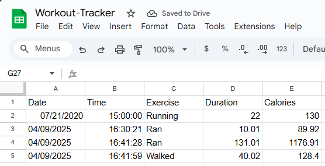
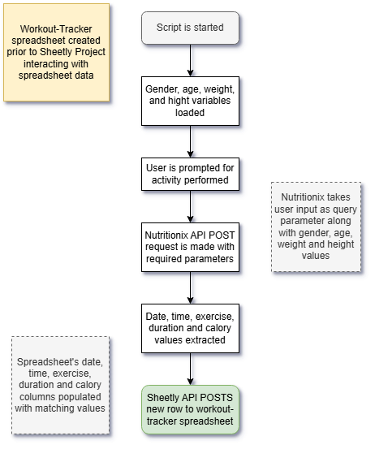

[nutritionixsite]: https://www.nutritionix.com/business/api
[sheetlysite]: https://sheety.co/
# Day 38: Workout Tracker

## Lesson Overview
**Day 38** didn’t introduce any new concepts. However, the day provided additional practice interacting with API endpoints, and API authentication.. One useful topic covered was modifying Google Sheets data using the **Sheetly** API.

This lesson didn’t provide video walkthroughs and instead provided instructions to refer to [**Sheetly**][sheetlysite] and **[Nutritionix’s][nutritionixsite] documentation**.
## Project
### Modules Used
#### Datetime
**Datetime** is used to format the date and time values that are uploaded to the **workout-tracker spreadsheet**.
#### Dotenv & Os
**Dotenv** and the **os module** are used for getting the environment variables used in the project.
#### Requests
**Requests** is used in this lesson to interact with the **Nutritionix** and **Sheetly API endpoints**.
### Project Walkthrough
The project starts by importing the modules listed in the **Modules Used section**.
#### 1. Querying the Nutritionix API Endpoint
Prior to making any request there are several constants created. Some of the constants created for the **Nutritionix API** include **GENDER**, **AGE**, **WEIGHT_KG**, and **HEIGHT_CM**. These values are passed as parameters when querying the API endpoint. The **“query”** parameter is obtained via **user input**. Once the user has provided an activity they performed, the **Nutritionix API POST request** is made.
#### 2. Transforming Returned Exercise Data
With the exercise data returned from the POST request, the **exercise**, **duration** and **calories** values are extracted from the JSON returned. Additionally, **datetime’s strftime** method is used to create **date** and **time** values that will be used in the workout-tracker spreadsheet.
#### 3. Writing to the Workout-Tracker Google Sheet
Having obtained the necessary column values, the next step in the project is to utilize **Sheetly’s POST endpoint** to append a row to the workout-tracker spreadsheet. **However, to use Sheetly**, Sheetly must first **have access** to the spreadsheet that is utilized, and a **project must be created**. Once those prerequisites are met, Sheetly can interact with the spreadsheet. Once the POST request is finished running, the user receives an output of the data that was written to the spreadsheet.

With that, you can navigate to the Google sheet and verify that data has been written successfully (as depicted in the screenshot above)!

### Project Flowchart
