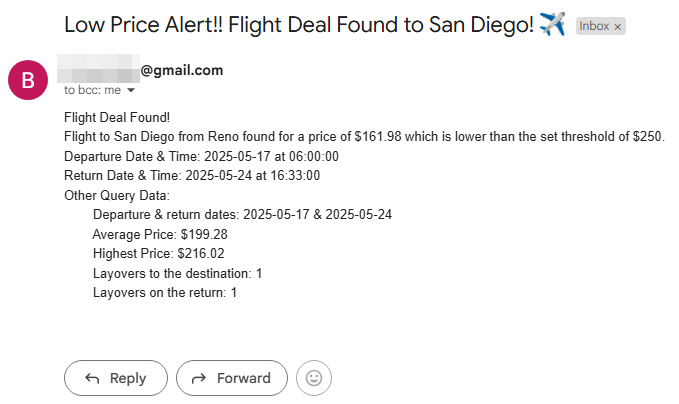

[amedeus]: https://developers.amadeus.com/
[sheetlysite]: https://sheety.co/
# Day 39 & 40: Flight Deal Tracker Capstone

## Lesson Overview
This capstone is the most complex project so far in the course and requires the most components to function. This documentation goes over the components that tie everything together.

The **Flight Deal Tracker capstone** was completed over two lessons. In the **project's day 39 version**, most of the program was created to send flight deals to a **single** recipient. For **day 40**, the project was modified to send flight deal emails to multiple recipients. To get a list of recipients, users fill out a Google Form to be added to a list of email subscribers!

One difference in my version of the project was that I chose to use **smtplib** instead of **Twilio on Day 39**. Although the project did eventually ask to use email for the **Day 40 version** of the project.

### Potential Modifiers
While working through the project, I identified the following potential improvements. However, that would be a job for another day!
-	Set different price thresholds for direct flights and flights with layovers since the layover flights tend to be cheaper.
-	Check for all flights regardless of whether they have a layover or not. The default behavior is to first check for direct flights and then check for all flights if there is no match.
-	Use international cities (Starting project started with international cities).
-	Add the ability to enter additional cities and set price thresholds.

## Project
### APIs Used
For this project, the following APIs were used:
-	[**Amedeus**][amedeus] – Amedeus is used in this project to obtain the IATA codes for the cities being searched. Additionally, Amedeus was used to return flight data for the destination cities.
-	[**Sheeyly**][sheetlysite] -  Sheetly is used in this project to interact with the **flight-deals spreadsheet** on **Google Sheets**. Sheetly is used to interact with both the **prices** and **users** tables.

### Modules used
#### Os & Dotenv
**Dotenv** and the **os module** are used for getting the environment variables used in the project.

#### Datetime
**Datetime** is used to format the date value used by the Amedeus API endpoint to return flight data.

#### Requests
**Requests** is used to interact with the Amedeus API and Sheetly API endpoints.

#### Smtplib
**Smtplib** is first used in Day 39 to send an email to a single user. On day 40, smtplib sends an email to a list of users

#### Time
The **time module** is used when querying the Amedeus flight search API endpoint. To avoid hitting any potential rate limiters, **time.sleep** is used to ensure there is a pause between queries.

### Project Files
#### Data_manager.py
**Data_manager.py** is responsible for interacting with **Sheetly** data. The **DataManager class** has three methods vital to this project.

The **get_data method** uses a GET request to retrieve spreadsheet data. This method is used to retrieve data from the prices and user tables.

**Get_customer_emails** returns a list of emails parsed from the **users table**. These emails are used in the project as recipients for flight deals that are found.

The **set_iata_code method** is used to set the **iata_codes** on the **prices table**. When the project is initially started, this column is blank. Working with **Amedeus**, the **IATA values** for the associated city are populated.

#### Flight_data.py
**Flight_data.py** contains the **FlightData** class and is used to parse through the JSON data that is passed through it and return a tuple of the parsed data. This parsed data is used in **main.py** to create a **dictionary** of the **data that will be used in the email sent to a user** if flight deals are found.

The data that is parsed from the **flight search JSON** data that is passed through includes: 
-	Lowest flight price (value starts at 10000. If value remains at 1000, no flights were found)
-	Date of departure flight
-	Date of return flight
-	Average price of flights queried
-	Highest price of flights queried
-	Layovers to and from the destination

#### Flight_search.py
**Flight_serach.py** has a single class called **FlightSearch**, which is responsible for interacting with Amadeus for various functions.

To interact with any of the API endpoints used in the project, **FlightSearch** must first obtain a **bearer token**. The **_get_new_token() method** is used to retrieve a bearer token and saves the token as an attribute.

The **get_iata_code method** is used to obtain the IATA codes for the city that is passed through. In order to ensure the right IATA code is returned, the **country code** is set to **US**, so only major US airports are used in this project.

Using the IATA codes from the Google Sheet data, flights to the destination are searched for using the **get_flight_data method**. The method takes various inputs, including **destination**, **departure date**, **return date**, and a default search value for **direct flights only**. This method is called again if direct flights are not found to **search for flights that may contain layovers**.

#### Main.py
**Main.py** contains all the logic that ties the various files in this project together. This includes populating the IATA codes on the Google Sheet, checking for flight deals, and emailing the recipient(s) flight deals if they are found. The **Project Walkthrough** section will go into more details of this logic.

#### Notification_manager.py
The **notification_manager file** has a single class, **NotificationManager**, which is used to send emails to the email address that is passed through. The class formats the email message that is passed through, along with the subject line, and then delivers the flight deal to the recipient’s email address.

#### Flight-Deals.csv
This file is simply an offline version of the flight-deals spreadsheet that exists within Google Sheets. The original version used for this project used international cities. For my take on this project, I used only United States cities to ensure the proper IATA was being populated when searching for flights in case there were multiple results for a given city name. The starting spreadsheet also has blank values for the **IATA Code column**. This offline version also does not include the **users table**, which is tied to the Google Form that is created on Day 40.

### Project Walkthrough
The project starts by importing the necessary modules and files listed above.

#### Checking IATA Codes
The first step after importing the necessary files is to verify that the **flight-deals spreadsheet** has the **IATA code values** populated. Using the **DataManager**, **Sheetly** checks to see if the **IATA Code column** has values that are populated. If the column values are empty, **FlightSearch** is used to search for the IATA code of the city that is passed through. With the IATA code obtained, the value is then populated into the spreadsheet.

#### Checking for Flights
Utilizing the IATA code values from the spreadsheet, the next step is to search for flight deals.

With the IATA codes populated, the data from the spreadsheet is saved to a **dictionary** and assigned to a **variable** called **flight_deals_data**.

The departure and trip duration dates are also obtained and assigned to variables. *I deviated from the project's instructions on getting these dates as I noticed that the return date for all results was exactly six months from the departure date*. To make the trips more realistic, I set the **search dates** to be **one month from the current date**, and the return date to be **7 days from the departure date**. These dates ensured a 1-week getaway vs a six-month trip would be returned.

Using a **For Loop** for each city **IATA code** in the **flight-deals spreadsheet**, a search is conducted for the data that is passed in using the **FlightSearch class**. If there are **no results returned for direct flights**, a **second query** is executed to search for **flights that include layovers**. 

If there are results for the searched destination, data is passed through the **FlightData** class to parse the necessary data. The **tuple** that is **returned** is then passed into a **dictionary** to store the **appropriate values**. The created dictionary is then appended to a **list** called **flight_results**, which is later used to send emails to the necessary recipients. 

#### Email Flight Deals
**Day 39** of the project started by sending flight deals to a **single recipient**. On **day 40**, this was changed to **send emails to multiple recipients**. To obtain a list of recipients, **Google Forms** is used to save data that is entered into the **flight-deals users table**. The email values from this table are saved to a list, which is then iterated through to send the flight deal emails.

Using a **For Loop** on the **flights_results** list, the script checks to see if the **entry’s price** is less than the **cheap flight threshold** that is set in the **flight-deals spreadsheet**. Each dictionary stored in the list is associated with a flight where data was returned. If the price threshold is satisfied, then a **For Loop** is used to **compose the body of the email** with data from the stored dictionary entry. This ***email is then sent to each recipient in the list***, containing the recipient's email.

### Project Flowchart

### Additional Images
Not all screenshots for this project were added to this document. For additional screenshots related to this project, files with the prefix **Day39-** and **Day40-** are stored in the top level **images folder**.
