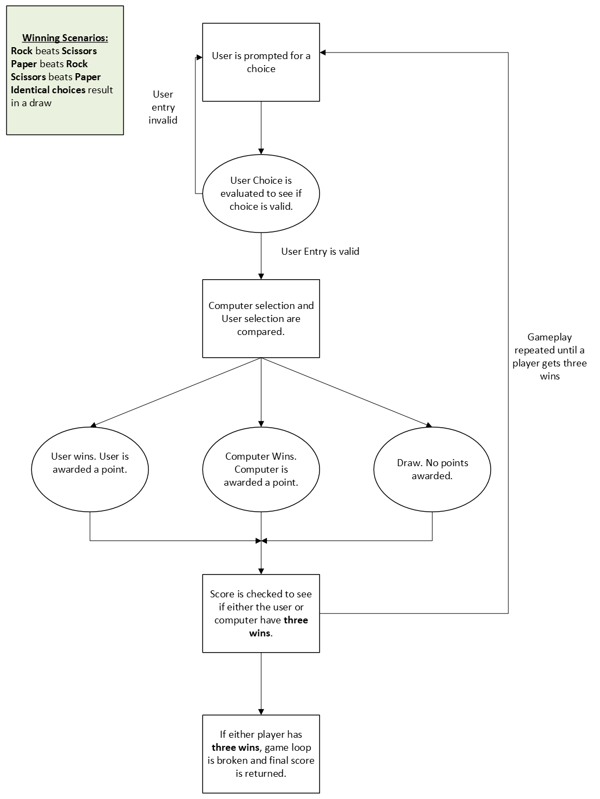

# Day 4 Project: Rock Paper Scisors
## Topics covered in leason include
- Random Module
- Python Lists
## Project
The program uses the random module to generate a choice of rock, paper or scissors for the computer user. The user is then prompted to select between 1, 2, or 3 to make a selection of rock, papper, or scissor from the choices list. 

Prior to proceeding to the game logic, the program verifies that the user entered a valid input between 1, 2, or 3. If the user did not enter a valid input, the user will be notified and prompted to make a chice again.

If a valid input is selected, the game play logic of rock, paper, scissors is evaluated to see who wins the game. The game is repeated until either the computer or the user playing the game wins three games.
## Game Diagram
