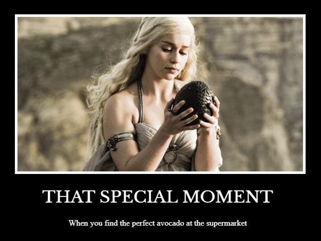

# Day 44: Motivational Poster Webpage
## Lesson Overview
**Day 44** builds on the CSS concepts introduced during Day 43. The lesson expands on CSS properties, including the following concepts: 
-	CSS inspection using Chrome Developer Tools
-	Color properties (**Background** & **text**)
    -   Named colors
    -   Hex code colors
-	Formatting fonts
    -   **Font-weight**
        -   Keyword
        -   Relative to the parent
        -   Numerical 
    -   **Font-size**
        -   Pixels
        -   Points
        -   Em
        -   Rem
        -   Named font sizes
    -   **Font-family**
        -   Specific vs generic fonts
        -   Serif vs sans-serif
    -   **Text alignment**
        -   Center, left, right
        -   Start, end
-	The Box model
    -   **Width** & **height** of the element
    -   **Padding** – adds space between the element and the border 
    -   **Margin** – space outside of the border
    -   **Border** – line of the box
-	**Content division** element – groups elements
## Project
Today’s project was another CSS challenge. The challenge was to format the page's contents to be styled as a motivational poster, including a black background, image, and white text. The project also used a custom font from Google Fonts to achieve the appearance of a motivational poster.

