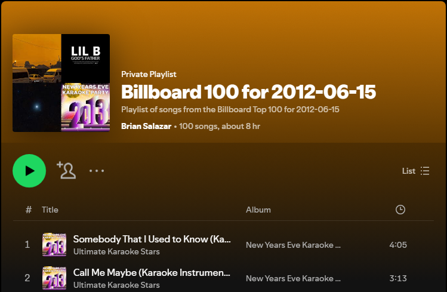
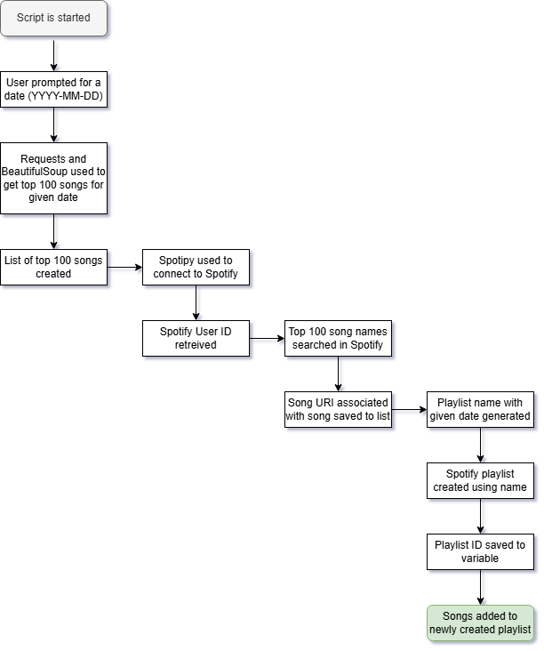

# Day 46: Top 100 Spotify Playlist

## Lesson Overview
**Day 46** provided additional practice working with **Beautiful Soup** and working with **APIs**. The days’ project was to scrape the Billboard Top 100 website on the given day for the top 100 songs for that day. Those songs are then searched in Spotify and added to a newly created playlist. 
### Potential Improvements
Although the programs requirements were met at completion of the project, I did notice that the top results for the songs queried were Kareke versions of the songs or songs by different artists. A potential improvement for another day would be to *add the songs artist to the search query when searching for songs in Spotify*. 
## Project
### Modules Used
#### Dotenv & os module
**Dotenv** and the **os** module are used in this project to retrieve the environment variables used.
#### Beautiful Soup
**BeautifulSoup** is used in this project to scrape the song titles from the Billboards Top 100 chart for the given date. Those song titles are then used to create a playlist in Spotify.
#### Requests
**Requests** is used to get the Billboards Top 100 web page for the specified date. The contents of the web page are then passed into BeautifulSoup for web scraping data.
#### Spotipy 
The **Spotipy** external module is installed to interact with Spotify. The module authenticates with Spotify, is used to search for songs, create a playlist, and add songs to the newly created playlist.
### Project Walkthrough
After importing the necessary modules and environment variables, the project starts by prompting the user for a date in the format of **YYYY-MM-DD**.  This value is saved to a **variable** and will be used to query the Billboard website and create a playlist with the date in the name.

After saving the date to a variable, **Requests** is used to query the Billboards website and obtain the list of the top 100 songs for the given date. **BeautifulSoup** then scrapes the data retrieved to obtain the titles of the top 100 songs. The song titles are then added to a list.

**Spotipy** is used to **authenticate** to Spotify utilizing the client ID and client secret obtained from the Spotify Developer console. 

After authenticating, the next step in the project is to **get the URIs** for the song names that were pulled from the Billboard website. For this project, I chose to **limit the value being returned to 1**. As mentioned in the potential improvements section, *this section can be further improved to ensure the proper song is retrieved*. The URIs that are retrieved are then added to a list called **song_uris**. 

Prior to adding songs to a playlist, a playlist first has to be created! **Spotipy** is used to **create a private playlist** with the given date in the name. For example “**Billboard 100 for 2025-04-24**”. 
With a playlist created and the song URIs obtained, **spotify’s playlist_add_items method** is used to add the songs to the playlist that was created. 

You can now take a trip down memory road and listen to songs that were popular at a given time!

### Project Flowchart 
