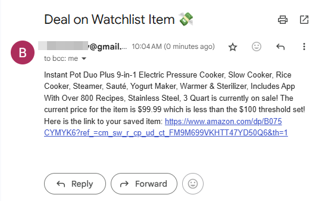
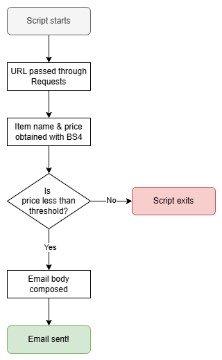

# Day 47: Amazon Price Tracker

## Lesson Overview
Day 47 of the 100 Days of Code course provides additional practice working with Beautiful Soup. The day’s project, scraping a website for an item’s price, provides a real-world example of how you can use Beautiful Soup. When the item’s price falls below a certain threshold, an email informs you that the item being monitored is on sale.
## Project
### Modules Used
#### Dotenv & os
**Dotenv** and the **os** modules are used in this project to retrieve the environment variables used.
#### Beautiful Soup
**Beautiful Soup** is used to retrieve the name and price of the item from the URL that is passed through requests.
#### Requests
**Requests** is used to obtain the page contents from the URL that is passed through. The lesson starts with a static website, but after testing, the lesson shifts towards working with Amazon’s live webpage. To work with the live site, **HTTP headers** are passed into the **request.get() method**.
#### Smtplib
When a price threshold is met, **smtplib** is used to send an email to the user informing them that the item is on sale! The email’s content contains the price of the item as well as the direct link to purchasing the item.
### Project Walkthrough
Compared to the previous day’s project, this project is less complex. However, the project provides another real-world use case for using web scraping.

After importing the necessary modules and environment variables, the project first starts by getting the contents of the Amazon webpage that is entered. To obtain the page's contents, **HTTP request headers** are required as a parameter. The web page is then parsed to obtain the **item’s name** and **price**. Those values are **saved to variables** to be used later in this script.

The script proceeds to check the item's price against a **threshold price**, which is set in a **constant**. If the item’s price is less than the threshold that is set, the program proceeds to compose an email. If not, the script is finished running.

If the program proceeds to send an email, the email’s body is composed using an **f-string**. The contents of the email include the item’s **name**, **price**, price **threshold**, and the direct **link** to purchase the item. With the body composed, **smtplib** sends the body to the specified email address!

### Project Flowchart

