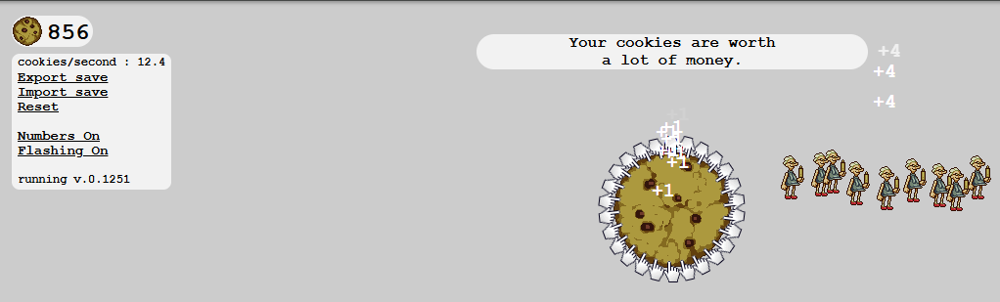

[cookieclickergame]: https://orteil.dashnet.org/experiments/cookie/
# Day 48: Cookie Clicker Game Bot

## Lesson Overview
**Day 48** introduces working with **Selenium** for web scraping. The day starts by scraping data from Wikipedia, and the Python.org website.
After the practice tasks, the main goal of the project is to automate the [cookie clicker game][cookieclickergame]. 
## Project
### Modules Used
#### Selenium
**Selenium** is used to automate aspects of the cookie clicker game by clicking on the cookie, keeping track of money, and purchasing upgrades to increase the number of cookies generated.
#### Time
**Time** is used in the module to check if upgrades can be purchased every five seconds. After 5 minutes, the games loop is ended to see how many cookies per second the automated game was able to achieve at the end of that time.
### Project Walkthrough
After importing the necessary modules, the project starts by identifying the **cookie button** and identifying the **store** entries. Additionally, **variables** are set for when to **check upgrades** (5 seconds) and what time to **end the game** (5 minutes).

With the cookie button and store identified, the game is ready to enter the game loop.

While **True**, the cookie button is clicked automatically. Within the while loop, an **If statement** is used to check if five seconds have passed. If five seconds have passed, Selenium is used to check if the user has enough money to purchase an upgrade. Depending on how much money the user has, the game bot purchases the store item with the highest value that the user can afford. This functionality is wrapped within a **Try/Except** block because there are instances where the user does not have enough money to purchase any items from the store generating a **ValueError**.

After five minutes have elapsed, the game’s loop is exited and the **cookies per second** is returned in the console!

