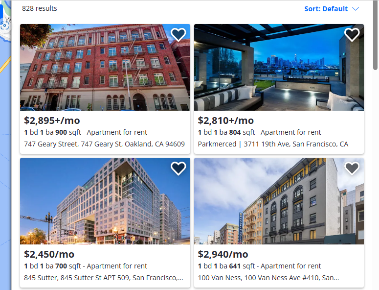
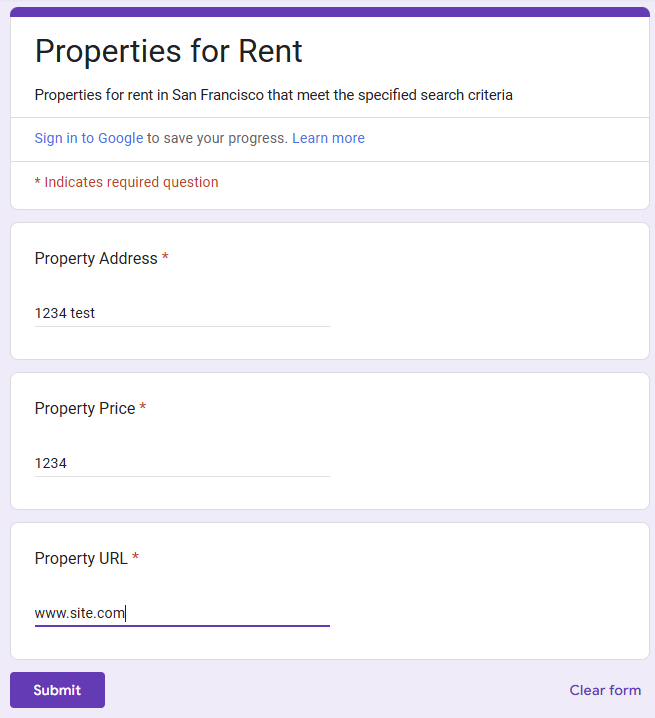
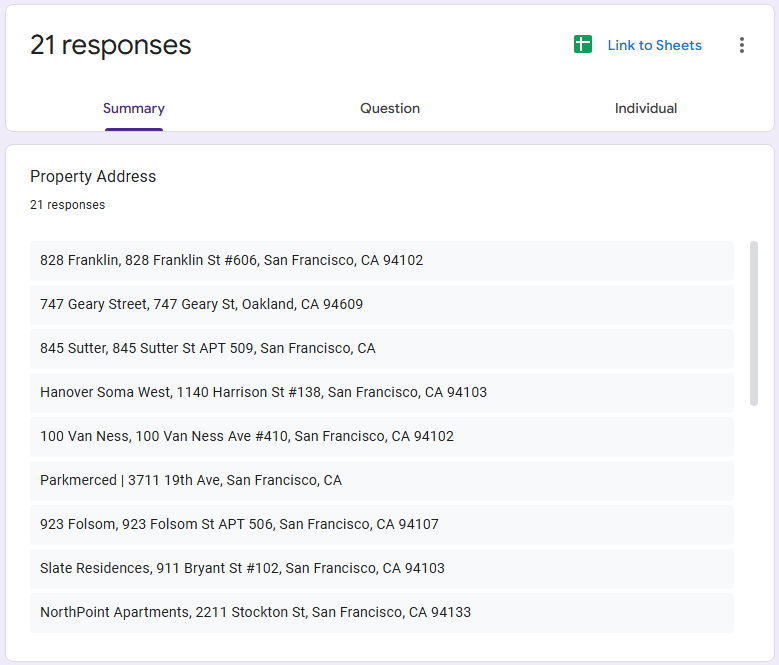
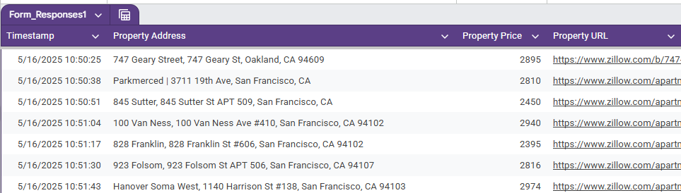
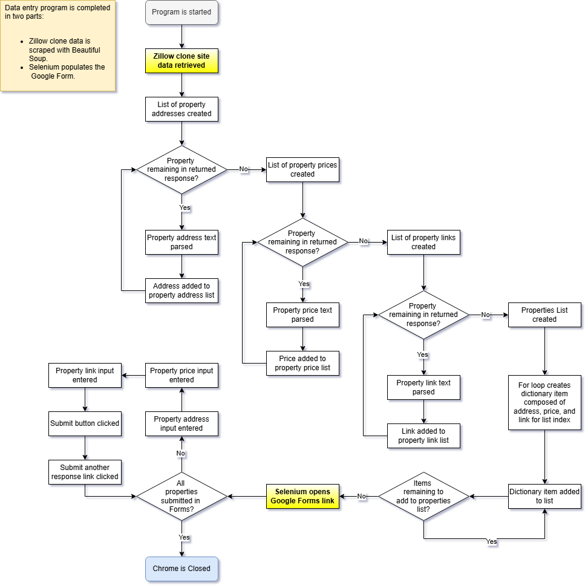

# Day 53: Rental Data Entry Autoamtion Capstone

## Lesson Overview
**Day 53** is the capstone project for the web scraping portion of this course. The project for the day scrapes data from a Zillow clone website using **Beautiful Soup**. Afterwards, **Selenium** is used to populate a Form with data that is parsed from the Zillow clone.

Unlike the previous few lessons, this project was completed from scratch. No code was copied from a previously completed project!
### Potential Improvements
The last few lessons utilized a class for completing the day's project. For this project, I opted to complete this project linearly. One way this project can be improved is to use **OOP** and complete this project.

Another area that could potentially be improved is to cut down on the number of **for loops**. There is a bit of repetition with what is being accomplished; however, I am satisfied with the code used for this project. 
## Project
### Modules Used
#### Os & dotenv
**Dotenv** and **os** are used to access the environment variables used in this project.
#### Requests
**Requests** is used to get the HTML data from the Zillow clone website used in this project.
#### BeautifulSoup
**BeautifulSoup** is used to parse the data that is returned using Requests. Data parsed includes the property address, price, and URL link.
#### Selenium
Selenium is used to submit the Google Forms responses with the data scraped from the Zillow clone website.
#### Time
**Time** is used in this project to pause after each action is performed. Pausing between actions mimics a more human-like behavior. Additionally, this slight delay allows for the web pages to load while iterating through the **properties list** entries and submitting the form responses.
### Project Walkthrough
The project first starts by loading the necessary modules and environment variables used for this project. This project utilizes the following constants:
-	**ZILLOW_URL**: This URL is used by **Beautiful Soup** for web scraping rental data.
-	**FORMS_URL**: This constant utilizes an environment variable to obtain the **Google Forms URL** used to submit responses. These responses consist of property addresses, prices, and URLs.
-	**CHROME_OPTIONS**: Selenium web driver options.
#### Scraping Zillow Clone Web Data
The first chunk of this project works with Beautiful Soup to obtain data from the Zillow clone website. 

After retrieving the HTML data using requests, Beautiful Soup is used to populate the following lists:
-	**Property_addresses**: Contains the property's address. Initially data returned has leading and trailing blank spaces. Strip is used to clean up this data.
-	**Property_prices**: Contains the property prices. Price data is cleaned so that a float value is saved to this list.
-	**Property_links**: Contains the href value associated with the property.

After the cleaned data is uploaded into the appropriate lists, another list called properties is created. Using a for loop, a dictionary item is created containing the property address, price, and link. This dictionary item is then appended to the properties list.
#### Entering Data into Google Sheets

With the necessary data, the next step in the project is to submit the data in a Google Form! Before starting this project, one of the **prerequisites** was to **create a Google Form** that requires the following data to be entered:
-	Property address
-	Property price
-	Property URL link

This step is simple and is accomplished within a for loop. A for loop is used to iterate through the **properties list**.

Inside the for loop, Selenium identifies the text entry fields. With the necessary data from the entry, the input field is populated. Once all three input fields are populated, the submit button is pressed. This brings up a page informing the user that the form has been submitted successfully. On the page, Selenium is used to click the “*submit another response*” link, which brings the program back to the form entry page. This process is repeated until all entries in the properties list have been submitted.

After submitting all the entries, the Chrome window is closed, and the terminal informs the user that the job is finished. All that is left is to go into the Form’s backend, view the responses and generate a Google Sheet for the data that has been submitted.

### Project Flowchart
