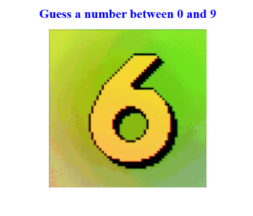
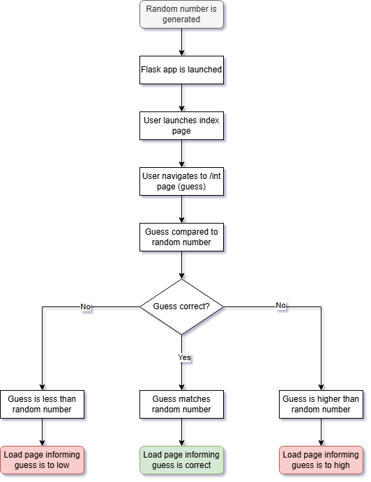
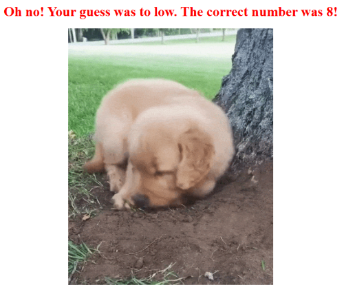
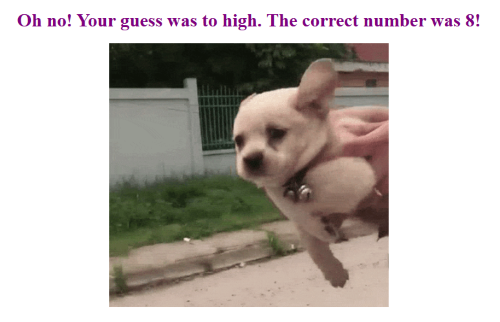
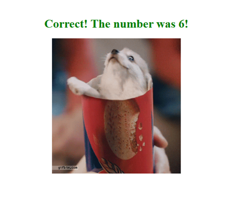

# Day 55: Number Guessing Website

## Lesson Overview
**Day 55** further builds on working with Flask and covers the following concepts:
-	Variable paths
-	Flask debugger
-	Converter types in variable paths
-	Using HTML in Flask
-	Using args and kwargs inside wrapper functions

The project for the day is to create a website that asks the user to guess a number. Based on the user's guess, a different web page is loaded.
## Project
### Modules Used
#### Random
**Random** is used to select a random number between 0 and 9.
#### Flask
**Flask** is used to render the web pages being loaded.
### Project Walkthrough
The project first starts by saving a random number between 0 and 9 to a variable. Afterwards, the Flask App is loaded.

When the user navigates to the index page, they are prompted to guess a number and pass it into the url link. 

Depending on is the URL path the user enters, the program returns a different web page. A different web page is loaded based on if the guess is too low, too high, or the user’s guess matches the random number.
### Project Flowchart

### Screenshots
User's guess is to high webpage.

User's guess is to low webpage.

User's guess is correct webpage.

