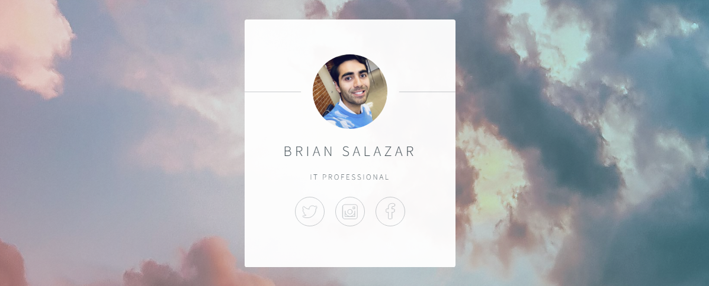

# Day 56: Name Card Website

## Lesson Overview
**Day 56** continues on the lessons of working with Flask. The day had several practice projects and the end project for the day was to create a **Name Card Website** using a premade template. Day 56 covered the following concepts:
-	Rendering HTML web pages
-	Adding assets and css to web pages in Flask apps
-	Using premade templates
## Project Walkthrough
This project is relatively simple compared to other projects completed in this course. The goal of this project was to copy over a starting template and modify the HTML code so that the assets could be rendered without any issues as depicted in the screenshot on this document!
