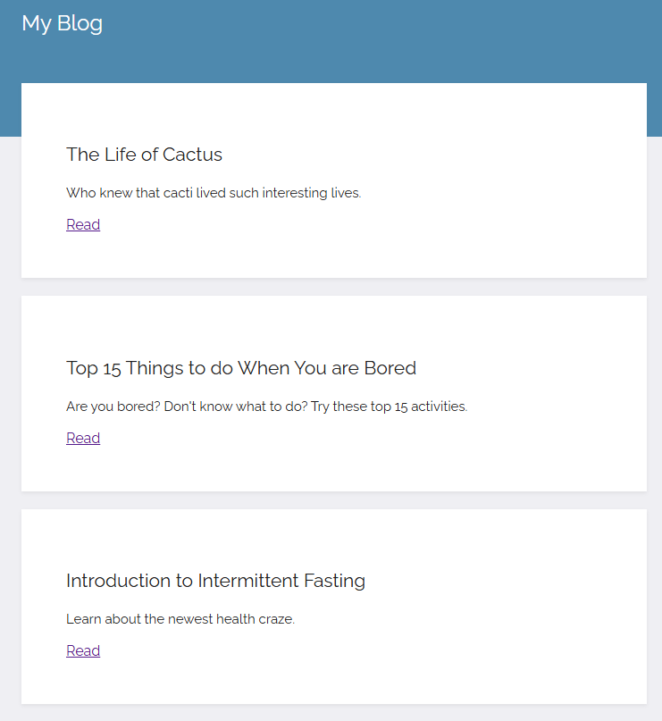
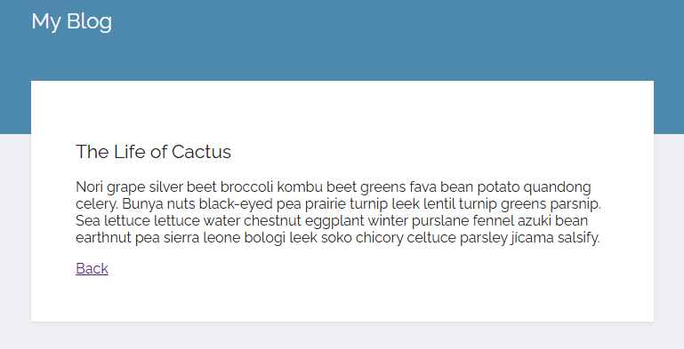

# Day 57: Blog Capstone Project Part 1
## Lesson Overview
**Day 57** continues the lessons of working with Flask. Day 57 also expands on the concept of **templating** using **Jinja**.  The project completed at the end of the day is to create a **blog website** using content pulled from an API endpoint. To achieve this with minimum code, templating was essential!
The lesson introduced the following concepts:
- Templating
- Jinja
    - **Single line markup** – {{ }}
    - **Multiline markup** – 
    - **URL building** – url_for(function name)
## Project
### Modules Used
#### Flask
**Flask** is used to render the blog website. This includes the index page and individual blog post pages.
#### Requests
**Requests** is used to query the API endpoint and retrieve the JSON data used for the blog posts.
### Project Walkthrough
This project is completed using multiple files. Main.py ties everything together and is responsible for running the Flask application.
#### Main.py
**Main.py** is responsible for running the Flask server. Main.py also imports the blog posts returned from the post.py file. With the blog posts on hand, main.py has two routes:
- **Home**: renders index.html with individual blog post titles and subtitles, along with a link to the complete blog post.
- **Blog_post**: renders an individual blog post based on the blog post’s ID.
#### Post.py
**Post.py** retrieves the blog post data using **requests**. This data is then passed through a **class** called **Post** to format a blog post object. A loop iterates through each blog post retrieved using requests and creates a list of blog post objects. This list is then passed into main.py
#### Index.html
**Index.html** displays the blog post data that is passed through using the **all_posts list**. The page lists the post’s title, subtitle, and a link to the individual blog post. Instead of creating individual items for each blog post, Jinja templating is used to cut down on the lines of HTML code.
#### Post.html
Based on the post ID that’s passed, **post.html** renders a blog post’s title, subtitle, and body. The page also has a link that returns the user back to index.html.

### Screenshots
Screenshot of the index.html page.

Screenshot of an individual blog post.

