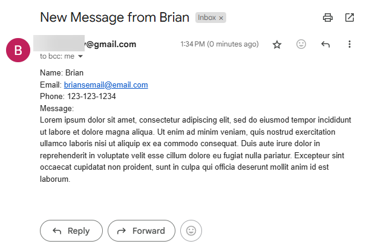

# Day 60: Blog Capstone Project Part 3 (Contact Form)
## Lesson Overview
**Day 60** focuses on submitting forms and POST requests with Flask. The lesson starts by creating a basic user input form to test working with POST requests and Flask. After completing the testing, the main goal of the day was to functionality to the contact page.
## Project
### Modules Used
#### Os & dotenv
**Os** and **dotenv** are used to load the environment variables used in the project.
#### Flask
**Flask** is used to render the routes for the blog website. The website is modified to add POST functionality when a form response is submitted.
#### Requests
**Requests** is used to get individual blog post information from the API endpoint set up in the previous parts of the project.
#### Smtplib
**Smtplib** is used to send an email to the blog owner when a user submits a form response.
### Project Walkthrough
This project expands on the blog website project that was created in the previous two parts of the blog website project. This section focuses on the contact page. 

When a user first loads the page, they are presented by contact form to submit their contact information. After submitting their contact information, the page is reloaded, and they receive a message informing them that their message was submitted successfully.

On the blog owner’s end, the user receives the user’s message via email as depicted in the screenshot below.
### Project Screenshots
Screenshot of the contact page H1 after a form is submitted.

Screenshot of an email received by the blog owner.

