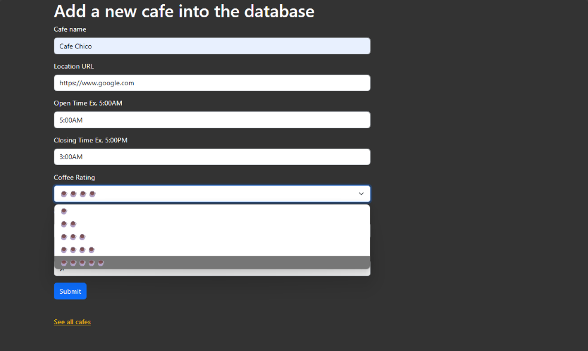

# Day 62: Café List Website

## Lesson Overview
Taking the lessons learned in **Day 61** of working with WTForms, **Day 62** takes that practice and applies it to a **café list website**. The website is simple and has three routes:
-	Home page
-	Café List page
-	Add page
The Project Walkthrough section will provide more details on how the pages are presented.
## Project
### Modules Used
#### Flask
**Flask** is used to render the routes used in the café list website.
#### Flask Bootstrap
**Flask Bootstrap** is used to add Bootstrap elements to the café list website.
#### Wtforms
**Wtforms** is used to create the **CafeForm class** which is then rendered on the add café page. The CafeForm has several fields including string fields and select fields (dropdowns). Validators are also used to ensure that data is entered properly.
#### Csv
The **csv** module is used to retrieve the café list csv data. This data is appended to a list which is then rendered in the cafes page.
### Project Walkthrough
This website is simple but leans into the lessons learned in the previous lessons to create the website. Below is an overview of the files used in this project.

#### Main.py
**Main.py** is responsible for rendering the Flask Routes. Main.py also has the **CafeForm class** which is called in the add route.
#### Add.html
**Add.html** is a “*secret page*” and renders the add café page. To access the page, the user has to add **/add** in the website’s URL. The add page displays the **CafeForm**. When the CafeForm is submitted successfully, the data entered in the fields is saved to the **café-data.csv** file.

#### Base.html
**Base.html** provides **template inheritance** for the web pages in the project. Base.html contains the styling elements used for the other pages in this project.
#### Cafes.html
**Cafes.html** displays the data passed from the **café-data.csv** file and displays it on a table. To accomplish this, a for loop iterates through the list of items that are passed through. Additionally, an if statement is used to check if the row has an index value of 0. If the row’s index is 0, that row is made the table header.

#### Index.html
**Index.html** is fairly plain. Index.html is the home page for the website. The user is only presented the option of viewing the café list.
