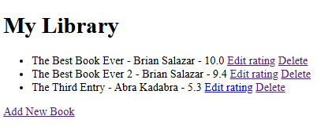
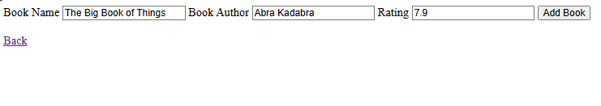
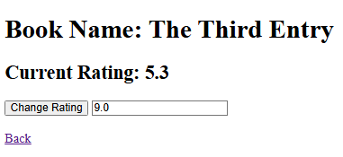

# Day 63: Book Rating Website
## Lesson Overview
Although the presentation of the website created on **Day 63** is basic, the main goal for this lesson is to **implement persistent storage**. The lesson starts by creating the website's basic functionality using a list of dictionary data to render the **book ratings**. However, there is a major flaw with this. When the server is reloaded, any data that was added does not persist. To circumvent this, persistent storage is needed, and that is the focus of this lesson.

Below are the concepts covered in this lesson:
-	Introduction to **sqlite** library
-	Introduction to **sqlalchemy**
-	**CRUD operations** using sqlalchemy

## Project
### Modules Used 
#### Os & dotenv
**Os** and **dotenv** are used in this project to load the absolute path environment variable. Due to the setup of this project, to ensure the database is created in the Day 63 folder, I had to use the absolute path for the database creation.
#### Flask
**Flask** is used to render the web pages for the book rating website.
#### Flask_sqlalchemy & SQLAlchemy
**Flask_sqlalchemy** and **SQLAlchemy** are used to create the book-reviews database, books table, and perform CRUD operations on the data stored in the database.
### Project Walkthrough
The books rating project includes a **requirements.txt** file. Prior to starting work on the project, the requirements need to be installed.

With the requirements installed, the first step in this project is to create the **books-review.db** file. Due to the structure of this project, the absolute path to the creation location is needed to ensure the database file is created in the appropriate directory.

The **books-review database** has a single table called **books**. That table contains the following data:
-	Book title
-	Book author
-	Book rating

Based on the operation performed, entries are added, modified, or deleted. The following Flask routes are used to render the website and perform database operations.

#### Home
The **index page** contains the list of book entries that are retrieved from the book-review database. On the page, there are also options to add new entries, edit existing entries, and delete entries. 

One major difference at the end of the day, compared to the initial setup up is that using a database to render data ensures that data is persistent if the server is restarted.

#### Add
The **add route** allows users to add an entry to the books-review database. The user provides the book name, author, and rating. When the submit button is pressed, that data is stored in the database, and the user is returned to the home page.

#### Edit
The **edit route** retrieves the specified book entry using the ID of the entry as a parameter. With the proper entry retrieved, the edit page renders the book's title and current rating. The user is presented with an input box where they can update the book's rating. If the book’s rating is updated, the database is also updated, and the user is returned to the home page.

#### Delete
The **delete route** deletes an entry from the books-review database based on the book's ID value. With the book deleted, the home page is reloaded to reflect the operation.

