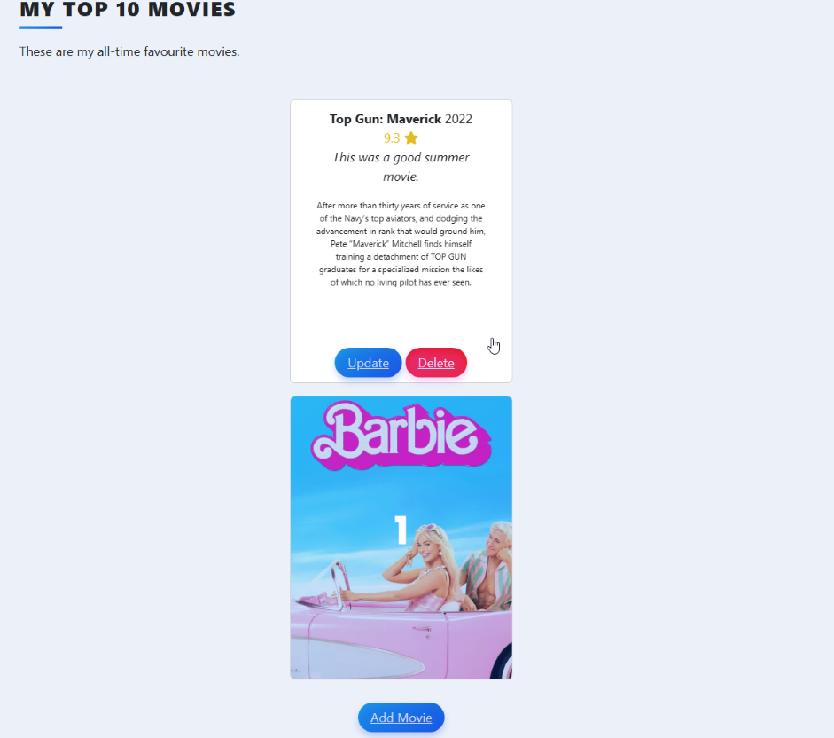

[tmdbwebsite]: https://developer.themoviedb.org/docs/getting-started
[tmdbsearchdoc]: https://developer.themoviedb.org/reference/search-movie
[tmdbiddoc]: https://developer.themoviedb.org/reference/movie-details
# Day 64: Top Movie List Website

## Lesson Overview
**Day 64** rachets up the intensity of the projects created so far in this course. The goal of this project is to create a **website that lists the top movies provided by a user**. These movies are displayed on the websites home page. The website also allows the user to edit the entries data, add new movies and delete entries.

This lesson works with the following concepts:
-	Rendering templates and routes with **Flask**
-	Rendering forms with **Flask Forms**
-	**SQLAlchemy** to store data
-	Querying API endpoints with **requests**.

The [screenshots](screenshots) folder contains screenshots of the pages that are rendered as part of this project.

## Project
### Prerequisites
Prior to starting this project, the requirements in **requirements.txt** need to be installed. At the time of me completing this project, I had to use **Python3 12.x** to complete the project. When using Python3 13.x, I ran into issues working with the version of SQLAlchemy used.

An account with TMDB is needed to obtain an API key. To query the endpoints, the bearer token is saved as an environment variable. Below are links to the TMDB website and API endpoints used.
-	[TMDB website][tmdbwebsite]
-	[TMDB search query][tmdbsearchdoc]
-	[TMDB id query][tmdbiddoc]

### Modules Used 
#### Os & dotenv
**Os** and **dotenv** are used in this project to load the environment variables used. Due to the setup of this project, to ensure the database is created in the Day 64 folder, I had to use the absolute path for the database creation.

#### Flask
**Flask** is used to render the web pages for the book rating website.

#### Flask_sqlalchemy & SQLAlchemy
**Flask_sqlalchemy** and **SQLAlchemy** are used to create the top-movies database, movies table, and perform CRUD operations on the data stored in the database.

#### FlaskWTF
**FlaskWTF** is used in the project to render the movie rating/review update form (**RateMovieForm**) and the form (**AddForm**) to search the TMDB API for the movie title that is passed through. For this project, the forms classes were created in a separate file called forms.py and imported into main.py.

#### Requests
**Requests** is used to query the TMDB API endpoints used in this project.

### Project Files
The following files are used in this project to execute the websites following. This list excludes the templates and static files.

#### Top-movies.db
The **top-movies.db** is created at the start of the lesson. The database has a table called movies that contains the following fields:
-	Title – Provided by TMDB result that the user selects.
-	Year – Provided from TMDB result.
-	Description – Provided from TMDB result.
-	Rating – Provided by the user.
-	Ranking – Sorted based on rating.
-	Review – Provided by the user.
-	Img_url – Provided by TMDB result.

#### Forms.py
**Forms.py** contains the two forms used in this project.
-	AddForm – Used to provide a query by the user and query TMDB.
-	RateMovieForm – Used to update the movies rating/review data.

#### Main.py
**Main.py** is where the magic happens. This includes creating the database and rendering the Flask routes used in the website. The Project Walkthrough section will provide more details on the functions performed in main.py

### Project Walkthrough
The project has various **constants**. These constants are used to provide the save location for the database that will be created as well as query the Movie Database for movie information.

The project first starts by creating a database called **top-movies.db** and a table called movies. The Project Files section provides more information about this table. After the table is created, two entries are added manually to the database to provide a starting point for this project. I left the code for these entries in main.py however, to avoid any errors, those entries need to be commented out. When the website is rendered, the movie information is displayed from the data stored in the top-movies.db

After the database and starting entries are created, the following Flask routes are used to render the website, query the Movie Database API, and perform database operations.

#### Home
The **home page** contains the list of movies added by the user. The movies are ranked based on the rating provided by the user. The higher the rating, the higher the ranking.
When a visitor hovers over a movie, they can edit the entry or delete it. Additionally, there is a button to add a movie which redirects the user to the add route.

#### Add
The **add route** allows users to add an entry to the top-movies database. The user is presented with a form to provide the movies title. The user is then redirected to select.html web page which lists the results that are returned from the Movie Database website.

#### Edit
**Edit** is used in two situations: **adding a new movie** and **editing an existing movie**.

When the user adds a movie, the user must provide a rating and review for the movie that is added. This data is stored in the top-movies database file.

When the user clicks on a movie and decides to edit the movie, they are presented with the movie’s current rating/review and a form to update the movie’s rating and review data.

In both situations, once the form is submitted, the user is redirected to the home page and the data is saved to the database.

#### Delete
The **delete** route deletes an entry from the top-movies database based on the movie’s ID value. With the movie deleted, the home page is reloaded to reflect the operation.

