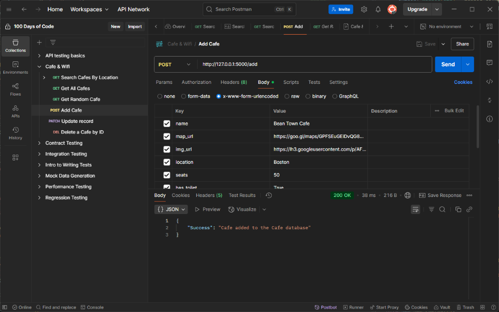
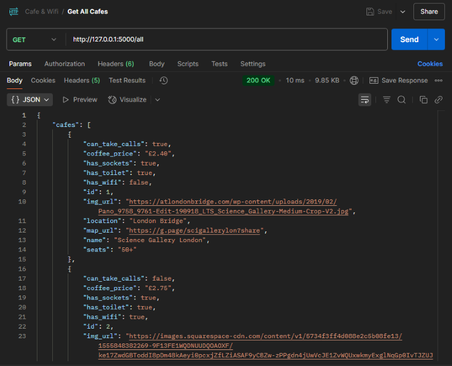

# Day 66: RESTful Routing with Cafe List Website
## Lesson Overview
Day 66 of the course introduces the process of creating RESTful APIs within a Flask application. The project for the day creates a API that returns café data based on the endpoint being queried. 

Below are the concepts covered in today’s lesson:
- Requests to web servers are typically accomplished using HTTP requests.
- Most important parts covered in making an API RESTful are
    - Using HTTP Request Verbs
        - GET
        - POST
        - PUT
        - PATCH
        - DELETE
    - Using specific patterns of routes/endpoint URLs
## Project
### Modules Used
#### Os & dotenv
**OS** and **dotenv** are used to retrieve the **ABS_PATH** environment variable used in this project to create the café database.
#### Random
**Random** is used to access a random café from the café database.
#### Flask
**Flask** is used to render the routes used in this project and return the JSON data retrieved from the café database.
#### Sqlalchemy
**Sqlalcheemy** is used to interact with the café database in this project. 
### Project Walkthrough
The project first starts by accessing the cafes database. Due to the nature of this overall project, the absolute path is used to access the database.

A class is then created to create a Café table inside of the database. Within this class, there is a method (to_dict) that can be called to convert the data from the entry that is called and return it as a dictionary. This comes in handy when returning the JSON output depending on the route being called.

The following routes are used in this project and can be broken down into the type of HTTP requests being made.
#### Home
The home route is simple and returns the index.html page. Of all the routes used, this is the only one that returns a template instead of JSON data.
#### GET Requests
The **random route** returns a random route from the café database and returns a JSON output.

The **all route** returns all the entries in the café database.

Using the specified location, the **search route** returns all the cafes that match the search location. If no cafes match the location, the user is informed that there are no results. Additionally, if the user accesses the route without the loc parameter, the user is informed to use the loc parameter

#### POST Requests
The **add route** is used to add a new café to the cafes database. To accomplish this, Postman is used to submit a POST request to the API endpoint.
#### PUT/PATCH Requests
When the user accesses the **update-price route**, a **PATCH request** is submitted. To access the specified café, the user needs to pass in a **café ID** value to retrieve the data from the database. The user is also required to pass in the **new_price** parameter to specify the new price of coffee. This route has a bit of error handling built in and catches situations when the café is not found and if the user does not provide the new_price parameter.
#### Delete Requests
The **report-closed route** is used to delete an entry from the café databases. To remove an entry, the user is required to specify the **café ID** in the route. Additionally, when accessing the route, the user needs to pass in a “**top secret API key**” to update the cafe
## Project Screenshots

*Cafe being added to database*

*All routes returned*