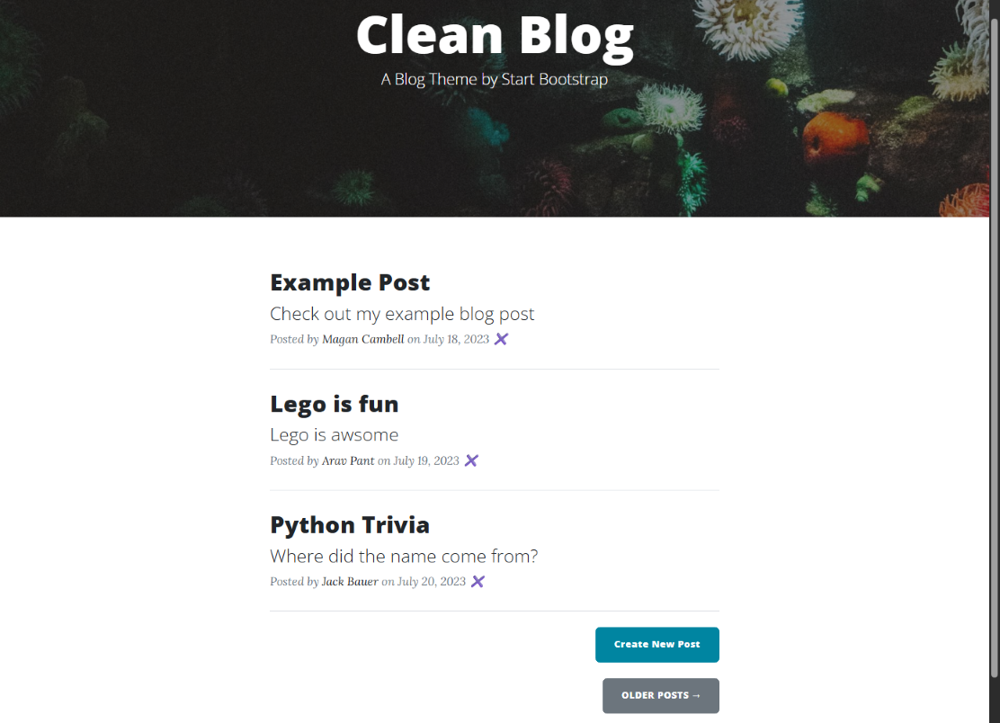

# Day 67: Blog Capstone Project Part 3
## Lesson Overview
**Day 67** enhances the functionality of the Blog website built out over the previous parts. Part three of the project adds the following enhancements:
-	Using SQLite to store blog post data instead of an online JSON endpoint.
-	The project also uses various request methods to interact with the database data.

This documentation will focus solely on the additions made during this part of the Blog Capstone project. For previously added features, refer to the documentation in the previous sections.
-	[Blog Capstone Part 1](../Day57-Capstone-BlogSitePt1)
-	[Blog Capstone Part 2](../Day59-Capstone-BlogSitePt2)
-	[Blog Capstone Part 2.5](../Day60-Capstone-BlogSitePt2.5)
## Project
### Modules Used
#### Os & Dotenv
**Os** and **dotenv** are used to load the ABS_PATH environment variable used to interact with the posts database.
#### Datetime
The postdate data in the database uses a particular format. **Datetime** is used to format the date entry that is added to the database when a new post is made.
#### Flask
**Flask** is used to render the Blog website and routes.
#### SQLAlchemy
**SQLAlchemy** is used to interact with the posts database. Within the database, there is a single table called blogpost that contains blog post entries.
#### Flask WTForm
**Flask WTForm** is used to create the Flask Form, which is used to add database entries. This form is also used to edit entries in the posts database. One unique field used in this project is the **CKEditorField**, which is used to render the **CKEditor**, allowing for the blog’s body to be created.
### Project Walkthrough
This documentation page will only focus on the functionality added as part of today’s project. Links to the other project additions are listed in the Lesson Overview section.

This project’s iteration uses a **SQLite database** to store blog post data. That database contains a single table called blogpost.

**Flask WTForms** is also used to render the form used to add/edit blog posts. This form is created using the **NewPostForm class** and contains string fields, a CKEditorField, and a submit field.

Outside of these additions, the rest of the website remains the same, except for the addition and modification of the following routes.
#### Home & Show_post (GET)
The **home** and **show_post** **routes** have been modified in this project to render data retrieved from the posts database instead of an online API endpoint.
#### Add_new_post (POST)
On the home page, there is a button to **add a new blog post**. Clicking on this button takes the user to the **add_new_post route**, which allows the user to enter the data necessary to add a new blog post entry.
#### Edit_post (POST)
The **edit_post route** retrieves a blog post and populates its data into the form used in the add_new_post route. Additionally, the H1 header is modified to reflect that the user is editing a post instead of adding a new post. This route is accessed when a user selects an individual post and the user clicks on the edit post button.
#### Delete Post (DELETE)
The **delete** route deletes a post using the specified id. 
### Screenshots
Home page screenshot

Individual blog post page

Edit blog post form

