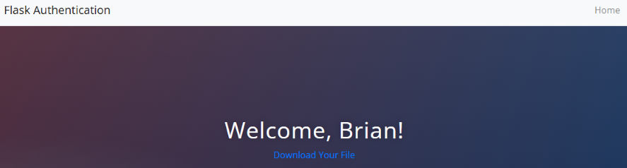
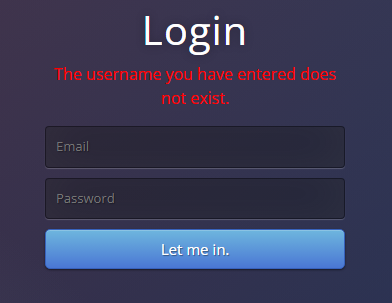
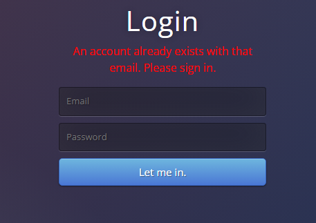

# Day 68: Flask Authentication Website

## Lesson Overview
**Day 68** introduces the concepts listed below. These concepts are used to create a website that requires authentication to download a Flask cheat sheet file.
-	Adding User authentication (storing passwords in plain text)
-	Downloading files
-	Encryption, decryption, and the importance of strong encryption
-	Hashing and hash functions (storing the hashed text instead of plain text)
-	Importance of strong passwords and hash tables
-	Combining salting with hashing to create even stronger password hashes
-	Using Werkzeug to generate hash and salt a plain text password

The [screenshots](screenshots) folder has screenshots of the web pages rendered as part of this project.
## Project
### Prerequisites
Prior to starting work on this project, the requirements listed in the requirements.txt file need to be installed.
### Modules Used
#### Os & dotenv
**Os** and **dotenv** are used to load the environment variables used in this project.
#### Flask
**Flask** is used to render the web pages and routes used for the Flask Authentication website.
#### Werkzeug
**Werkzeug.sercurity** is used to generate a hashed and salted password as well as compare a user’s password that is entered against the value stored in the users database.
#### SQLAlchemy
**SQLAlchemy** is used to interact with the users database used in this project. This includes adding new users and retrieving user information when a user logs in.
#### Flask Login
**Flask login** is used to manage user sessions. The module is used to log users in, log them out, and make that routes are restricted if a user is not logged in.
### Project Walkthrough
After loading the necessary modules, setting up the **login_manager** and setting up the users database, Flask is used to render the following routes.
#### Home
The **home route** is responsible for rendering the home page. Based on *if the user is logged in or not*, the user is presented with the options to **login** or **create an account**.
#### Register
The **register route** is used to register new users. When a user registers, they are required to provide their name, email and enter a password. The password that is entered is hashed and salted with **werkzeug** before the values entered are entered in the users database.

If an account already exists with the email entered, the user is redirected to the login route with a warning message informing the user that a user account with that email already exists.
#### Login
The **log in page** allows the user to log in with their email and password. If either of these values are incorrect, the user is informed with an error message. If the user can successfully log in, they are redirected to the **secrets** page.
#### Secrets
To access the **secrets page**, the user must be logged in. If someone tries to access /secrets without being logged in, they will be informed they are not authorized to access the page.

After successfully logging in, the user is presented with a page where the user can download a secret file using the download route.
#### Logout
The **logout route** is simple. When the user clicks logout in the navigation bar, they are logged out and redirected to the home page.
#### Download
The **download route** is called when the user clicks the url on the secrets page. The file that is downloaded can be found I the static/files folder.

### Screenshots
Screenshot of error messages rendered.

