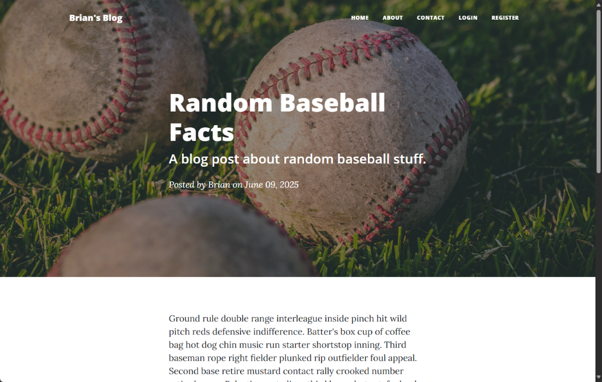

# Day 69: Blog Capstone Project Part 4 (Final)

## Lesson Overview
This is the **final iteration** of the blog capstone project. For **Day 69**, the goal of this project was to incorporate the lessons learned in the previous lesson, which involved using **Flask authentication** and **flashing error messages** to users when they fail to authenticate. This iteration on the blog website also enhances the database storage capabilities introduced in previous labs by setting up a **relational database** with **multiple tables**. 

This readme file will focus on today’s iteration of the website. The links below link directly to the previous iterations of the blog website project.
- [Blog Capstone Part 1](../Day57-Capstone-BlogSitePt1)
- [Blog Capstone Part 2](../Day59-Capstone-BlogSitePt2)
- [Blog Capstone Part 2.5](../Day60-Capstone-BlogSitePt2.5)
- [Blog Capstone Part 3](../Day67-Capstone-BlogSitePt3)
## Project
### Prerequisites
The **requirements.txt** file includes all the modules needed and the versions used. Prior to setting up this project, those modules need to be installed.

### Modules Used
#### Os & Dotenv
**Os** and **dotenv** are used to import the absolute path environment variable used in this project.

#### Datetime
**Datetime’s** date method is used when a new blog post is added to the blog website. The date is formatted using **strftime** prior to the post being submitted.

#### Flask
**Flask** is used to render the routes and templates used in this website.

#### Flask Login
**Flask login** is used to manage user sessions. The module is used to log users in, log them out, and ensure routes are restricted when they need to be restricted. 

#### WTFlask Forms 
**WTFlask forms** are used to render the various forms used in this project. The Project Files section provides more details on the forms used on this website.

#### SQLAlachemy
**SQLAlchemy** is used to interact with the **posts database**. This includes adding new users, retrieving their information, creating blog posts, and adding comments to blog posts. All this data is stored in tables that are further elaborated in the **Project Files section**.

#### Werkzeig
**Werkzeig.security** is used to generate a hashed and salted password as well as compare a user’s password that is entered against the value stored in the posts database.

### Project Files
The following subsections provide an overview of the files used in this project. These subsections exclude the templates used in the project and static content.

#### Post.db
**Posts.db** contains the persistent storage needed to make this website function. The database initially starts with only a single table, **blogposts**, but as the project progresses, additional tables are added, and relational data is used to add functionality to the website.

Below is a brief overview of the data contained in each table.
- **Blogposts**: The blog posts table contains blog post data. Only the admin of the website is allowed to add blog content to the website. The administrator of the website is the first user that creates an account.
- *Users**: The users table contains a list of all users who have registered an account on the blog website. The first user who registers is the administrator and the only one allowed to add/edit blog posts. All other users who register can add comments to blog posts. 
- **Comments**: The comments table contains comments left by users of the blog website. For users to leave a comment, they must first create an account.

#### Forms.py
Different from the other iterations of this project, **FlaskWTF forms** are set up in their own file and are imported into main.py. The following is a brief overview of each form that is used in this project:
- **CreatePostForm**: The CreatePostForm is uses the **CKEditor** to create a blog post.
- **RegisterForm**: The RegisterForm is used for users to register an account on the website. Once registed, users will be able to add comments to blog posts.
- **LoginForm**: The LoginForm is used by users to log into the blog website. If a user account does not exist, the user will be prompted to create a new account.
- **CommentForm**: The CommentForm also uses a CKEditor for users to add comments to existing blog posts.

#### Main.py
**Main.py** is where all the magic happens for the project. The project walkthrough section will provide further details; however, all the forms are imported into main.py along with the database and flask routes. 

### Project Walkthrough
The project first starts by importing the necessary modules and the forms in the forms.py file. Afterwards, the login manager is set up and a custom function that mirrors the **login_required function** is created to restrict routes to the website’s administrator.

Afterwards the three tables are defined. The tables are defined using the **BlogPost class**, **User class**, and **Comments class**. As the project evolved, a relationship was established between all three tables to allow users to create accounts, allow the site administrator to create and edit posts and allow users to add comments to posts.

With that, the following flask routes are used to carry out the functionality of the blog website.

#### Register
The **register route** is used to allow users to create an account on the blog post website. This route calls on the **RegisterForm** from the **forms.py** file.

After the user’s data is validated, if an account does not exist, the user’s password is hashed and salted before it is added to the posts database file.

Once registered, the user is logged in and redirected to the home page.

#### Login
The **login route** utilizes the **LoginForm** and allows the user to log in. The route first checks if a user account does not exist and if they have entered an incorrect password. If either of these conditions are met, the user is notified. If the user can log in successfully, they are redirected to the home page.

#### Logout
The *logout route* is simple. If a user is logged in, they are logged out. This route is only visible if a user is signed in. 

*Login and register are also only visible if the user is not signed in.*

#### Get all posts
**Get all posts** is the home page of the website. This route lists all of the blog posts in the blog post database.

#### Show post
The **show post route** displays an individual blog post. At the bottom of the page, there is a comment section where authenticated users can add comments to the blog post.

*If a user is not signed in*, they are informed and redirected to the login page if they try and add a comment.

#### Add new post
The **add new post route** is restricted to only allow the site administrator to add new posts. The route has the **login_required** and **admin_required decorators**. 

Once those conditions are met, the **CreatePostForm** is used to add a new blog post to the posts database. Once a new post is added, the administrator is redirected to the home page.

#### Edit post
The **edit post route** is restricted to only allow the site administrator to add new posts. The route has the **login_required** and **admin_required decorators**. 

The route calls on the **CreatePostForm** and allows the site administrator to make changes to an existing blog post. Once changes are accepted, the user is redirected to the home page.

#### About
The **about route** renders the about page.

#### Contact
The **contact route** renders the contact page. Note that this route is not used in this project whereas it is used in days 2 and 2.5.

### Project Screenshots
Screenshots for this folder can be found in the [screenshots folder](screenshots). Screenshots include screenshots of web pages, flash messages, and the database used for this project. No data stored in the database is sensitive.

