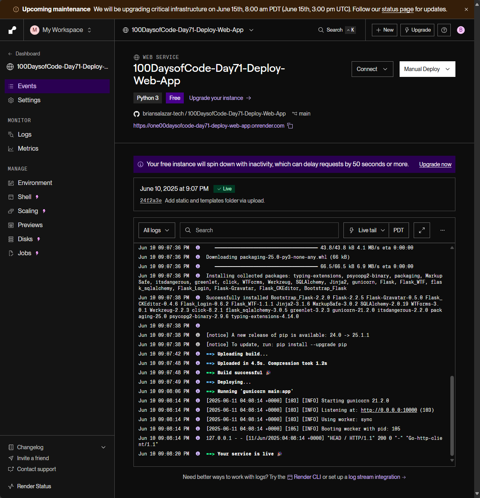

[RenderLink]: https://render.com/
[OriginalRepo]: https://github.com/briansalazar-tech/100DaysofCode-Day71-Deploy-Web-App/tree/main
# Day 71: Deploying Blog Site Web App
## Lesson Overview
**Day 71** of the course put into practice yesterday’s concepts by uploading the blog capstone project to GitHub. Since the goal of this entire repository is to put into practice working with GitHub and version control, this lesson was simply following along.

Where the tires met the road, was deploying the website on [**Render**][RenderLink]. To deploy the blog website on Render, I linked the [blog website repository][OriginalRepo] that I completed when I initially finished this course. In addition, the blog’s database was upgraded to **PostgreSQL** on Render to make the website’s data more persistent on the platform.

