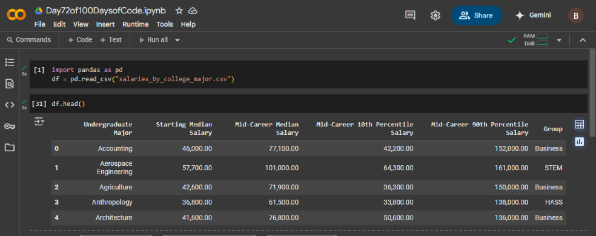

# Day 72: Data Exploration - College Degrees vs Post University Salaries

## Lesson Overview
Switching from web development, **Day 72** switches to the data analysis/science portion of the course. The projects that finish up this course use **Python Notebooks** inside of **Google Colab**. This project introduces working with **Pandas** and uses a dataset of college majors and their post-university salaries from 2008.

## Project
### Project Files
#### Day72of100DaysofCode.ipynb
This is the Python Notebook used to analyze the csv file using Pandas.
#### Salaries_by_college_major.csv
This csv file is used by the Python notebook for data analysis.
### Modules Used
#### Pandas
Pandas is used in this module to interact with the salaries_by_college_major.csv file. Pandas is used to analyze the spreadsheet, analyze data in the spreadsheet, and transform the data being analyzed.
### Project Walkthrough
The project starts by getting data on the data frame being analyzed, such as the size of the data frame, column names, and the data frame's shape. 

The next step proceeds to finding NaN values and removing them. With NaN values removed, the notebook then proceeds to analyze the data in the clean data frame. Data analyzed includes finding majors with the highest starting salaries, lowest starting salaries, mid-career salaries, etc. A column is added to insert the difference between the highest and the lowest salaries. The data frame is then sorted to find the degrees with the lowest/highest spread values. The lesson ends by creating pivot tables using the pandas **groupby() method**.
