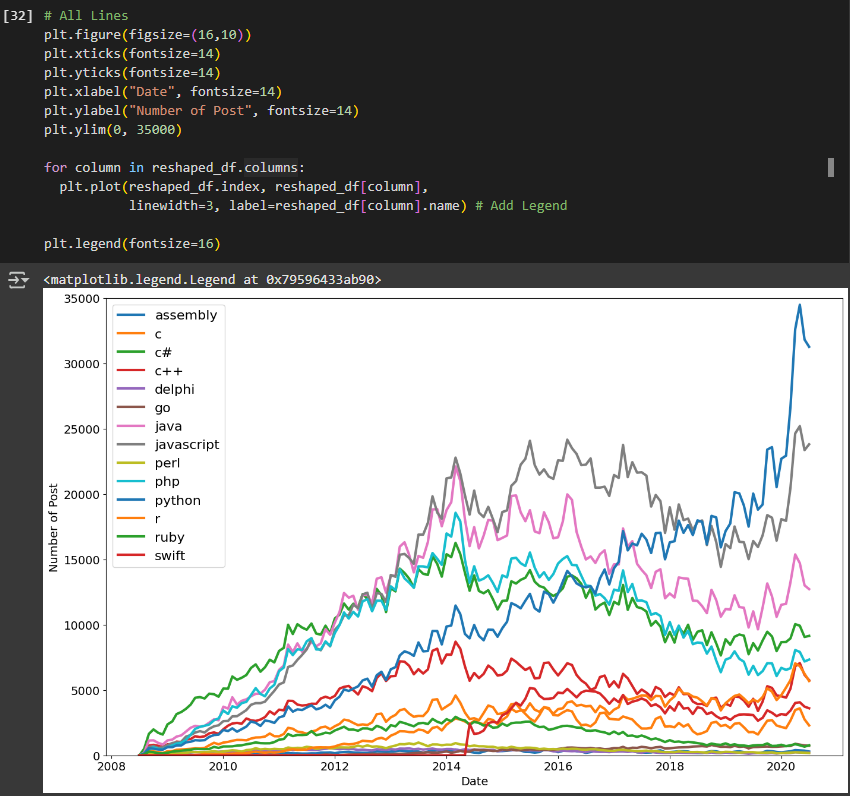

# Day 73: Data Visualization – Programming Languages

### Lesson Overview
**Day 73** continues the data science portion of the course but also introduces data visualization using **MatPlotLib**.
## Project
### Project Files
#### Day73of100DaysofCode.ipynb
This is the Python Notebook used to analyze the csv file using Pandas and visualize data with Matplotlib.
#### QueryResults.csv
This csv file is used by the Python notebook for data analysis.
### Modules Used
#### Pandas
The **Pandas** library is used to gather data and explore the data from the **QueryResults.csv** file.
#### MatPlotLib
**MatPlotLib** is used to create charts and visualize the data from **QueryResults.csv**.
### Project Walkthrough
#### Data Exploration
The notebook first starts by importing the csv file as a data frame and performing basic analysis of the data in the csv file. This includes getting the shape of the data frame as well as the number of rows and column names.

The notebook proceeds to group the tag columns which is the name of the programming language get the sum of the posts per language.

With the data analyzed, the nest step is to clean the data. The date column’s entries are in string format and need to be converted to a datetime object. This is accomplished with pandas **to_datetime() method**. Converting this to a datetime object allows for the column to be maluplated further.

Using Pandas **pivot() method**, the data frame is reshaped to list the **TAG values** as the **columns**. Essentially making each programming language it’s own column vs the original data frame which had the columns of **TAG**, **DATE**, and **POSTS**. After reshaping the data, basic information such as its shape, counts, and checking if there are NaN values are checked.

#### Data Visualization
With the data exploration bit out of the way, the next step is to visualize the data using **MatPlotLib**. Basic graphs are plotted but they are later transformed to produce more visually appealing graphs. 

The charts plotted start with one line but proceed to plot multi-line charts. Firth with two languages and then with all the programming languages in the data frame. 

