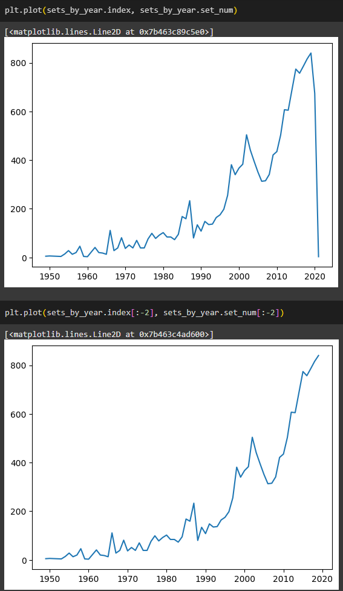
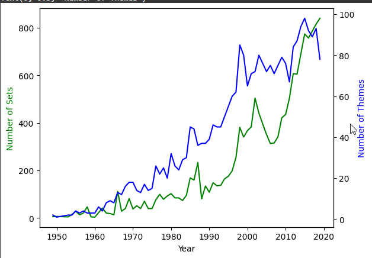
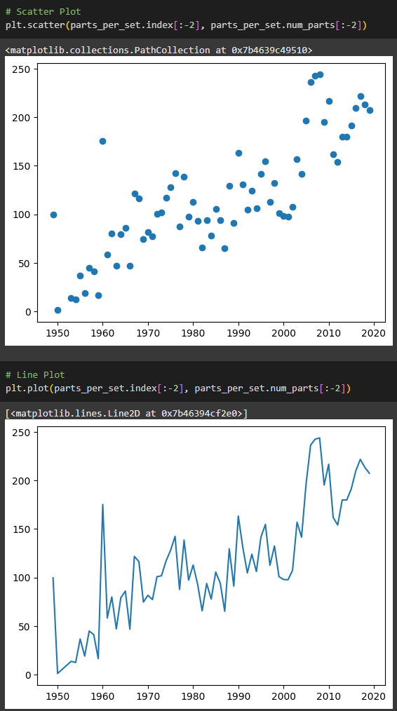
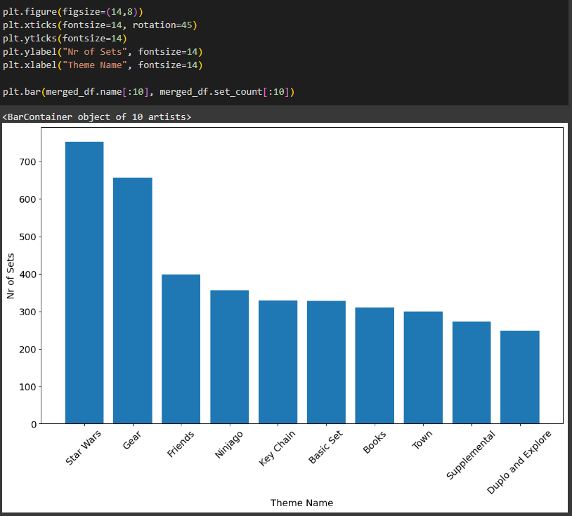

# Day 74: Aggregate and Merge Lego Dataset Data

## Lesson Overview
**Day 74** continues the data science portion of the course. The lesson provides a deep dive into a LEGO dataset. In the days lesson the following questions are answered:
-	How many parts did the largest LEGO set have?
-	What year was the first LEGO set released?
-	What themes have the most sets?
-	How have LEGO sets grown in complexity over time?
-	When did LEGO sets take off?

This lesson introduces the following concepts:
-	Combining HTML into notebooks.
-	Aggregating data with .agg().
-	Creating scatter plots, bar charts and line charts.
-	Understanding database schemas and merging data frames that share a common key.
## Project
### Project Files
#### Day74of100DaysofCode.ipynb
This is the Python Notebook used to analyze the csv files using Pandas and visualize data with Matplotlib.
#### Colors.csv, sets.csv, themes.csv
These CSV files inside the data folder are used for this project for analysis.
### Modules Used
#### Pandas
The **Pandas** library is used to gather data and explore the data from the csv files.
#### MatPlotLib
**MatPlotLib** is used to create charts and visualize the data in this project.
### Project Walkthrough
#### Introduction
The introduction section goes over what the outcome of the notebook will achieve. The project also starts by adding an image and HTML elements to make the notebook more visually appealing.
#### Data Exploration
Moving on to the data exploration portion of the notebook, the notebook starts by identifying how many unique colors and transparent colors there is in the **colors.csv** file.

The next step is to look at the **sets.csv** file. Basic data about the sets file are gathered using **.head()**, **.tail()**, and **sorting by the year value**. Sorting by year reveals when the first Lego set was released. In addition, we can find the set with the most number of parts using **sort_values()**. Graphs are added to analyze the number of sets released every year. Since the dataset is from mid-2020, slicing is used to remove the incomplete data from being plotted.

The pandas **agg() function** is then used to get the number of themes released per year. In 1949, there were two themes released vs 82 in 2020. Line Charts are then created to plot the number of themes per year vs the number of sets per year released.

MatPlotLib isn’t just used to make line plots, the lesson proceeds to make a **scatter plot** of the number average number of parts per set each year.

The lesson rounds out by looking at the **themes.csv** file and merging the data frames based on a key. That data is then plotted on a **bar plot** to display then umber of sets for the top themes.

