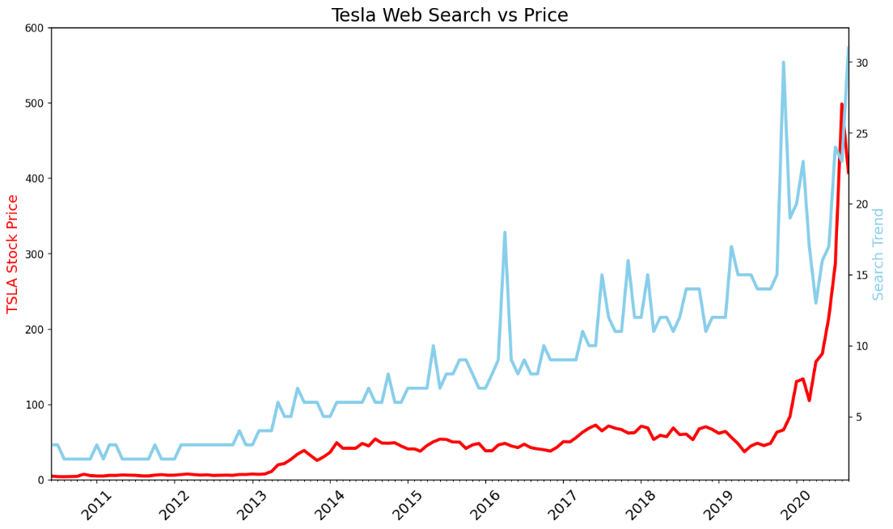
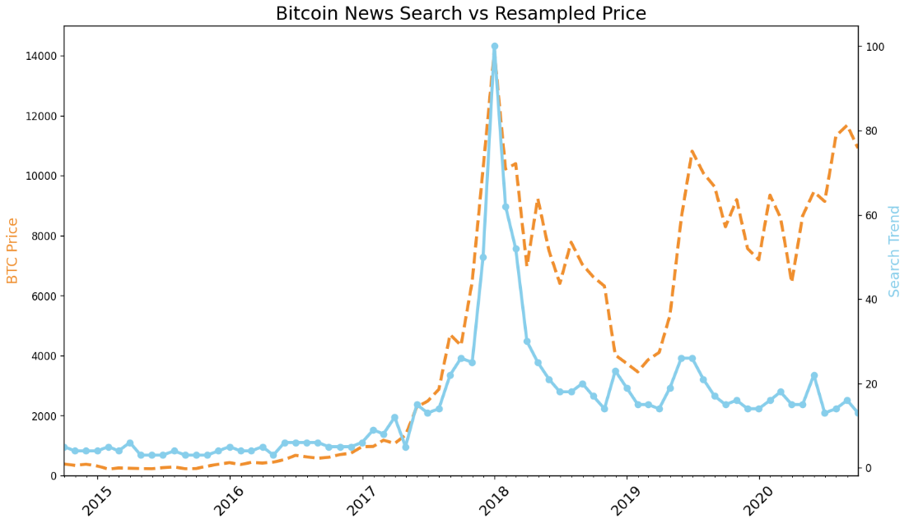
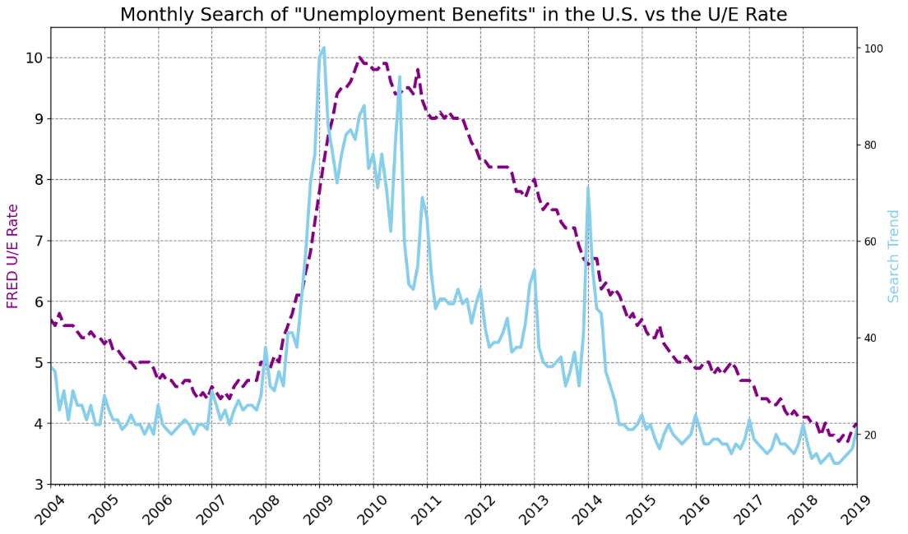

# Day 75: Combine Google Trends with other Time Series Data
## Lesson Overview
The focus of **Day 75** is to analyze Google Search trends. Trends analyzed include examining how search volume for “Bitcoin” relates to the price of Bitcoin, how search volume for “Tesla” stock relates to the price, and how searches for “Unemployment Benefits” vary with actual unemployment rates in the U.S.
## Project
### Project Files
#### Day75of100DaysofCode.ipynb
This file is the Python notebook used to complete this lesson. The file in this project is the completed notebook.
#### Data folder
The CSV files inside the data folder are the CSV files analyzed using the Python notebook.
### Modules Used
#### Pandas
The **Pandas** library is used to gather data and explore the data from the csv files.
#### MatPlotLib
**MatPlotLib** is used to create charts and visualize the data in this project.
### Project Walkthrough
#### Introduction
Prior to performing data exploration, pandas and matplotlib are imported into the notebook. Additionally, the CSV files analyzed are read into variables so they can be used in the project.
#### Data Exploration
The notebook proceeds to gather data on the three web search trends, such as the shape of the data frames, column names, smallest and largest numbers in the search data column.
#### Data Cleaning
With basic data retrieved from the data frames, the next step is to see if there is any missing data. The notebook checks for NaN values in the data frames and drops them from the data frames. 

In addition to checking for NaN values, the dataframes MONTH and DATE columns are in string format, Pandas **to_datetime method** is used to convert these values to datetime objects. 

In addition, Pandas **resample method** is used to convert daily data to monthly data for the Bitcoin data frame. 
#### Data Visualization
The first graph that is plotted is a graph comparing Tesla stock vs Google search volume for the stock. A basic graph is first inserted; however, styling is added to make the graph easier to read and more visually appealing. 

Next up is to analyze Bitcoin prices vs search volume. Similarly to the Tesla graph, a line plot is created, however more styling is added to differentiate the lines.

Rounding out the graphs created are line graphs created for unemployment rate data.

